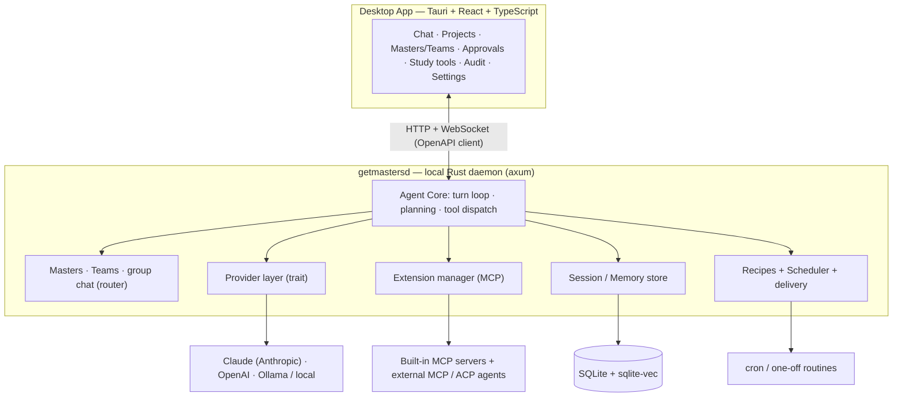

  

<h1 align="center">Masters</h1>

  <em>A local-first, single-user <strong>agentic desktop companion</strong> for <strong>personal study and work</strong>.</em>

Masters is a desktop application in the spirit of [Claude Cowork](https://www.anthropic.com/product/claude-cowork)
— you point it at your local folders and it *does the work*: reads, edits, and creates files, runs multi-step
tasks end to end, and keeps you in control of consequential actions. Its architecture follows
[Goose](https://github.com/block/goose) (Rust core + local daemon + desktop shell + MCP extensions + recipes
and a scheduler), but its built-in tools and UX are retargeted from *coding* to **studying** (reading,
note-building, grounded Q&A over your own materials, flashcards, study plans) and **personal work** (file
organization, document synthesis, recurring routines). It further borrows from
[Hermes Agent](https://github.com/NousResearch/hermes-agent) a *learning loop* — self-improving **Skills**
(procedural memory) and **layered, file-backed memory** the user can edit — adapted to a local-first,
single-user design (see [ADRs 0006–0009](./docs/adr/)). From [WorkBuddy](https://www.workbuddy.cn/) it adopts
**Projects as context containers** and **Master Teams** — named personas, each running on its own model, that you
assemble and chat with as a group with @-mention addressing (see [ADRs 0010–0014](./docs/adr/)).

> **Status:** In active development. Phases 0–4 are implemented — a Rust workspace + the `getmastersd` daemon, a
> gated tool-calling agent loop, Knowledge/RAG, Study, file-backed Memory + Skills, Recipes + Scheduler + outbound
> delivery, Master Teams + multi-master group chat, and external MCP/ACP agents, plus a Tauri desktop UI. The
> numbered `docs/` package remains the authoritative spec; see [DEVELOPMENT.md](./DEVELOPMENT.md) and
> [CLAUDE.md](./CLAUDE.md) for the current implementation state.

---

## What makes Masters different

| | Claude Cowork | Goose | Hermes Agent | **Masters** |
|---|---|---|---|---|
| Focus | Knowledge work | Coding agent | Always-on assistant | **Study + personal work** |
| Users | Individual | Developer | Self-hoster | **Individual learner / knowledge worker** |
| Runs | Cloud-coupled desktop | Local | Self-hosted (laptop → cloud) | **Local-first, single-user** |
| Providers | Anthropic only | 15+ | Model-agnostic | **Claude-first, pluggable** |
| Extensible | Connectors | MCP (open) | Skills + tools | **MCP (open) + self-improving Skills** |
| Memory | Projects + memory | Sessions | Layered file memory | **File-backed, layered + Skills** |
| Multi-agent | Subagents | Subagents | — | **Master teams + @-mention group chat** |
| Open source | No | Yes | Yes | Yes |

---

## Documentation

Read in order; each builds on the previous.

| # | Doc | What's inside |
|---|-----|---------------|
| — | [README.md](./README.md) | This file — intro, doc index, architecture sketch |
| 00 | [docs/00-overview.md](./docs/00-overview.md) | Vision, target users, value prop, Cowork/Goose comparison |
| 01 | [docs/01-product-requirements.md](./docs/01-product-requirements.md) | PRD: personas, journeys, MVP/v1/later features, non-goals, metrics |
| 02 | [docs/02-architecture.md](./docs/02-architecture.md) | System architecture, components, agent loop, diagrams |
| 03 | [docs/03-tech-stack.md](./docs/03-tech-stack.md) | Technology choices + rationale + alternatives |
| 04 | [docs/04-extensions-mcp.md](./docs/04-extensions-mcp.md) | Extension model, built-in MCP servers, recipes |
| 05 | [docs/05-data-storage-rag.md](./docs/05-data-storage-rag.md) | SQLite schema, RAG/embedding pipeline, vector store |
| 06 | [docs/06-security-privacy.md](./docs/06-security-privacy.md) | Sandbox, approvals, secrets, audit log, retention |
| 07 | [docs/07-ux-flows.md](./docs/07-ux-flows.md) | Key screens & user flows |
| 08 | [docs/08-roadmap.md](./docs/08-roadmap.md) | Phased milestones MVP → v1 → v2 |
| 09 | [docs/09-projects-masters.md](./docs/09-projects-masters.md) | Projects as context containers · Masters (persona-over-Skill) · Master Teams |
| 10 | [docs/10-ui-design.md](./docs/10-ui-design.md) | UI design system: color tokens, layout, components, interaction principles · Manus/Cowork comparison · enhancements |
| — | [docs/adr/](./docs/adr/) | Architecture Decision Records (0001–0014) |

---

## Architecture at a glance

## Tech stack (selected defaults — see [ADRs](./docs/adr/))

- **Core + daemon:** Rust (Cargo workspace), Tokio, axum (HTTP/WS), OpenAPI codegen
- **Desktop shell:** Tauri 2 + React + TypeScript + Vite + Tailwind/shadcn
- **LLM:** Claude-first (Anthropic) via a provider trait; OpenAI / Ollama pluggable
- **Storage / RAG:** SQLite + [`sqlite-vec`](https://github.com/asg017/sqlite-vec)
- **Extensions:** Model Context Protocol via the official Rust SDK (`rmcp`); external coding agents over ACP
- **Build:** Cargo + Just / Make + pnpm

## Install & first run

Pre-built desktop packages are produced by the **Desktop Build** GitHub Action and attached to each
tagged [GitHub Release](https://github.com/shushuo/masters/releases):

- **macOS (Apple Silicon):** download the `.dmg`, open it, drag **Masters** to Applications.
- **Windows (x64):** download the `.msi` (or `*-setup.exe`) and run it.

> **Unsigned builds.** Releases are not yet code-signed/notarized, so the OS will warn on first launch.
> - macOS: right-click **Masters.app → Open** (or `xattr -dr com.apple.quarantine /Applications/Masters.app`).
> - Windows: SmartScreen → **More info → Run anyway**.

On **first launch** the bundled `getmastersd` daemon creates its data home at **`~/.getmasters`** (holding
`getmasters.db` and per-project files under `projects/`), and the desktop shows a short **setup** step to
pick a model provider, enter an API key, and (optionally) grant a working folder. You can skip setup to
run offline against the built-in mock provider, and change everything later under **Settings** / **Projects**.

Override the data home with `GETMASTERS_HOME=/path` (or point `GETMASTERS_DB_PATH` at an explicit DB file).
Build from source instead with the steps in [DEVELOPMENT.md](./DEVELOPMENT.md).

## Data & security posture

- **Where data lives:** everything at rest is under `~/.getmasters` (the SQLite DB + your projects' Markdown
  memory/skills/recipes/masters). Nothing is uploaded except the model calls you make.
- **Secrets:** API keys live in the **OS keychain** (macOS Keychain / Windows Credential Manager / Linux
  Secret Service), never in the database or a plaintext config file.
- **Sandbox model:** Masters has no standing access to your disk. Every side-effecting tool call passes
  through a **permission gate**; file tools are confined to **folders you explicitly grant** (paths are
  canonicalized so symlinks/`..` can't escape); external MCP servers run with **credential stripping**
  (a cleared environment plus only the vars you configure); and a **Blank Slate** least-privilege posture
  re-prompts for every action. See [docs/06-security-privacy.md](./docs/06-security-privacy.md).

## License

Apache-2.0 (intended; matches the Goose lineage).
