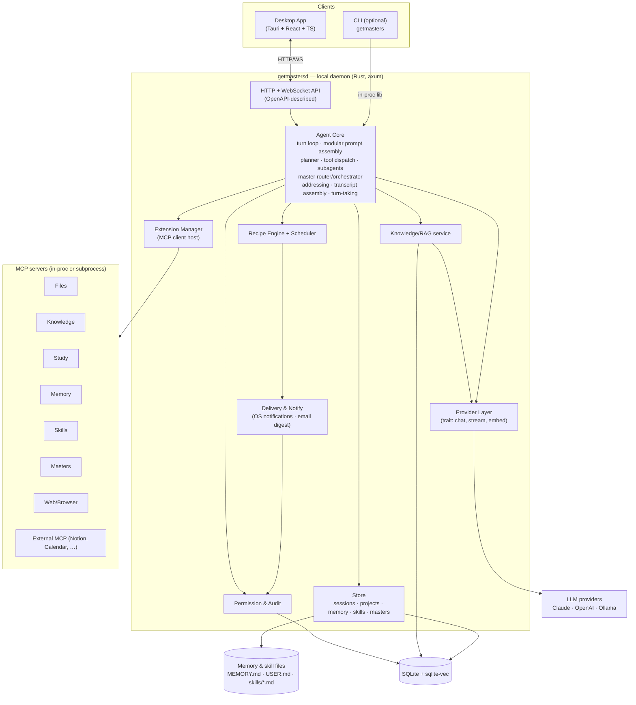
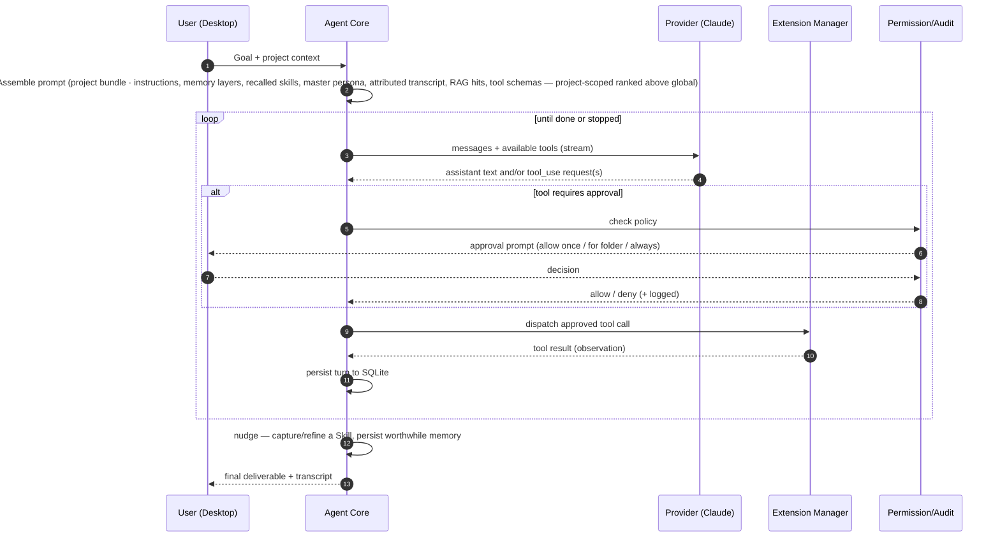
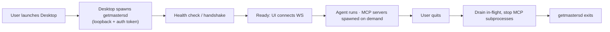

# 02 — Architecture

This document describes Masters's system architecture. It adapts Goose's proven layout — a Rust core, a local
daemon, an optional CLI, a desktop shell, and an MCP extension layer — to Masters's study/work focus.

## 1. High-level components



### Component responsibilities

| Component | Responsibility | Goose analogue |
|---|---|---|
| **Desktop App** | UI: chat, projects, folder grants, approvals, study views, settings; supervises the daemon | `ui/desktop` (Electron→**Tauri**) |
| **CLI** (optional) | Terminal access; links the core crate directly, no daemon needed | `goose-cli` |
| **getmastersd (daemon)** | Long-running local server exposing the agent over HTTP/WS | `goose-server` / `goosed` |
| **Agent Core** | The turn loop: **assemble the prompt from modular sources**, call provider, dispatch tools, optionally spawn subagents, persist, repeat | `goose` core (+ Hermes prompt assembly) |
| **Provider Layer** | Uniform trait over LLM backends (chat, streaming, embeddings); dispatches each master subagent to **its master's configured model/provider** ([ADR-0013](./adr/0013-per-master-model.md)) | provider system |
| **Extension Manager** | Hosts MCP servers, aggregates their tools, routes tool calls | extension manager |
| **Store** | Persist sessions/messages/projects in SQLite; **memory & skills as files + DB index** | session manager (+ Hermes file-backed memory) |
| **RAG service** | Ingest → chunk → embed → vector + FTS search over project docs | (new — Masters-specific) |
| **Skills service** | Capture/improve/recall **procedural memory** (skill files); never bypasses gating | (new — adapted from Hermes) |
| **Masters service** | Manage **master personas/teams** (persona files); router *recommends* — never executes | (new — adapted from WorkBuddy) |
| **Master Router / Orchestrator** (in Core) | Map a brief to master(s)/team; resolve @-mention addressing; assemble the author-attributed group transcript; enforce turn-taking/loop-safety; fan out **gated** parallel subagents and/or sequential stages; merge results | (new — adapted from WorkBuddy) |
| **Recipe Engine + Scheduler** | Run declarative workflows; one-off & cron triggers | recipes + scheduler |
| **Delivery & Notify** | Deliver routine output via OS notifications / opt-in email (`send`, gated) | (new — adapted from Hermes gateway) |
| **Permission & Audit** | Enforce folder scopes, least-privilege & action approvals; log everything | (new — first-class in Masters) |

## 2. Rust workspace layout (proposed)

Mirrors Goose's Cargo-workspace structure:

```
getmasters/
├── crates/
│   ├── getmasters-core        # Agent loop, planner, provider trait, store, RAG, permissions
│   ├── getmasters-server      # axum HTTP+WS daemon → binary `getmastersd`
│   ├── getmasters-cli         # optional CLI → binary `getmasters`
│   ├── getmasters-mcp         # built-in MCP servers (Files, Knowledge, Study, Memory, Skills, Masters, Web)
│   └── getmasters-proto       # shared DTOs / OpenAPI types
├── ui/desktop/            # Tauri 2 + React + TypeScript app
├── recipes/               # example recipe YAML files
├── docs/                  # this documentation
└── Justfile               # task automation (build, run-ui, gen-openapi, test)
```

## 3. The agent loop



Key behaviors:
- **Streaming first.** Tokens and tool-step events stream to the UI over WebSocket as they happen.
- **Interruptible.** A stop signal cancels the in-flight provider/tool call cleanly between steps.
- **Grounded.** Before/within the loop, the RAG service injects retrieved, cited chunks into context for
  questions about project materials.
- **Context-bundled.** When the session runs under a Project, the Core auto-injects the Project's bundle
  (instructions, memory, skills, masters, grants, connectors) and ranks **project-scoped items above global**
  during assembly and recall ([ADR-0011](./adr/0011-project-context-container.md)).
- **Learning.** Relevant Skills are recalled into the prompt at the start; after a successful complex task the
  agent is nudged to capture or refine a Skill and persist worthwhile memory ([ADR-0006](./adr/0006-skills-procedural-memory.md),
  [ADR-0007](./adr/0007-layered-memory-prompt.md)).
- **Orchestrated.** For a brief routed to a Master Team, the Core selects masters and runs them as isolated,
  gated subagents (parallel and/or staged), merging results — every subagent step still passes Permission &
  Audit ([ADR-0010](./adr/0010-master-team-orchestration.md), [ADR-0008](./adr/0008-agent-isolation-parallelism.md)).
- **Conversational.** A multi-master session is a **single-user group chat**: turns are @-addressed (or handled
  by the team's coordinator master when unaddressed); each master reads the full author-attributed transcript
  (*shared read context*) but its tool calls stay isolated and gated (*isolated gated execution*); turn-taking is
  bounded and the user holds the floor (Stop halts the group) ([ADR-0012](./adr/0012-multi-master-conversation.md)).
- **Gated.** Side-effecting tools — including every step a recalled Skill drives and any outbound delivery —
  pass through Permission & Audit before execution.

## 4. Client ⇄ daemon contract

- Transport: **HTTP** for request/response (projects, settings, sessions CRUD, ingest jobs) and **WebSocket**
  for streaming a live agent run (token deltas, tool-step events, approval requests).
- The API surface is described by **OpenAPI**; the desktop's TypeScript client is **code-generated** from it
  (as Goose generates its client when server code changes). This keeps the UI and daemon in lock-step and gives
  one source of truth for DTOs.
- The daemon binds to **loopback only** (`127.0.0.1`) on an ephemeral port, with a per-launch token the desktop
  passes on every request — so other local processes can't drive the agent. (See [06 — Security](./06-security-privacy.md).)

## 5. Process & lifecycle model



- The desktop **owns** the daemon's lifecycle (spawn, health-check, restart on crash, shutdown).
- MCP servers are launched lazily when first needed and torn down on exit.
- The **Scheduler** is the one component that may keep the daemon (or a headless variant) alive to fire
  recurring routines; v1 fires them only while the app is running (see roadmap for a background-service option).

## 6. Data flow examples

**Grounded question over project docs**
`UI question → Core → RAG.retrieve(embed query → sqlite-vec search) → Core injects cited chunks → Provider →
answer with citations → UI`.

**File reorganization task**
`UI goal → Core plans → Files.list/read (auto-approved within grant) → Provider proposes renames → Core
requests approval for each move → on approval, Files.move executes → audit logged → UI shows result + revert`.

## 7. Where Masters deviates from Goose

| Area | Goose | Masters | Why |
|---|---|---|---|
| Desktop shell | Electron | **Tauri 2** | Lighter footprint for a personal app ([ADR-0002](./adr/0002-desktop-shell.md)) |
| Providers | 15+ from day one | **Claude-first**, pluggable | Simpler MVP; matches "Claude Cowork–like" ([ADR-0003](./adr/0003-llm-providers.md)) |
| Built-in tools | Dev-centric (shell, code) | **Study/work-centric** (Files, Knowledge, Study) | Different audience |
| RAG | Not first-class | **First-class** Knowledge service | Grounding on personal materials is core |
| Permissions | Present | **First-class & central** | A local file-acting agent must be trustworthy |
| MCP impl | Internal (migrating to SDK) | **Official `rmcp` SDK** from the start | Avoid legacy debt ([ADR-0005](./adr/0005-mcp-sdk.md)) |

## 8. What Masters borrows from Hermes

Goose supplies the *structural* blueprint; [Hermes Agent](https://github.com/NousResearch/hermes-agent) supplies
the *learning loop and trust posture*. Borrowed, then adapted to local-first/single-user:

| Hermes idea | Masters adaptation | Reference |
|---|---|---|
| Self-improving **Skills** (procedural memory) | **Skills** service + files; gated execution; bridges to Recipes | [ADR-0006](./adr/0006-skills-procedural-memory.md) |
| Layered, file-backed memory (`MEMORY.md`/`USER.md`) + curation nudge | Typed memory as editable files (truth) + DB index; nudge-based curation | [ADR-0007](./adr/0007-layered-memory-prompt.md) |
| Modular prompt assembly from editable sources | Core composes prompts from defaults + instructions + memory + skills + RAG | [ADR-0007](./adr/0007-layered-memory-prompt.md) |
| Defense-in-depth: least-privilege, isolation, credential stripping; parallel subagents | Blank Slate mode, MCP sandboxing, isolated subagents — **no** remote/serverless execution | [ADR-0008](./adr/0008-agent-isolation-parallelism.md) |
| Multi-platform delivery gateway | **Outbound-only** OS notifications + opt-in email — **no** messaging-bot/inbound surfaces | [ADR-0009](./adr/0009-outbound-delivery-surfaces.md) |

**Validations (Hermes confirms choices Masters already made):** one shared agent core across desktop + CLI
([ADR-0001](./adr/0001-backend-language.md)), the right-hand live tool-activity panel ([07](./07-ux-flows.md)),
the built-in cron scheduler, and SQLite as the single store.

## 8a. What Masters borrows from WorkBuddy

A third analogue, [WorkBuddy](https://www.workbuddy.cn/) (a single-user-adjacent desktop office agent),
supplies the **Project-as-context-container** and **Master-Team** structure — adapted to Masters's single-user,
local-first stance ([09](./09-projects-masters.md)):

| WorkBuddy idea | Masters adaptation | Reference |
|---|---|---|
| Project bundles instructions/connectors/masters/skills/knowledge, auto-injected into each task | **Project = context container**, project-scoped items ranked above global; project templates | [ADR-0011](./adr/0011-project-context-container.md) |
| "1 brief, 100+ masters": personas + a master router decomposing across parallel/sequential agents | **Masters = persona-over-Skill** + master router; orchestration via **gated** parallel subagents | [ADR-0010](./adr/0010-master-team-orchestration.md) |
| Multi-master "group" conversation with @-mention | **Single-user group chat** metaphor: @-addressing, shared author-attributed transcript, bounded turn-taking | [ADR-0012](./adr/0012-multi-master-conversation.md) |
| Multi-user collaboration, task sharing/handoff, inbound IM control | **Dropped** — single-user, outbound-only | [00 non-goals](./00-overview.md), [ADR-0009](./adr/0009-outbound-delivery-surfaces.md) |

See [03 — Tech Stack](./03-tech-stack.md) for the full technology list and [04 — Extensions/MCP](./04-extensions-mcp.md)
for the extension layer in detail.
