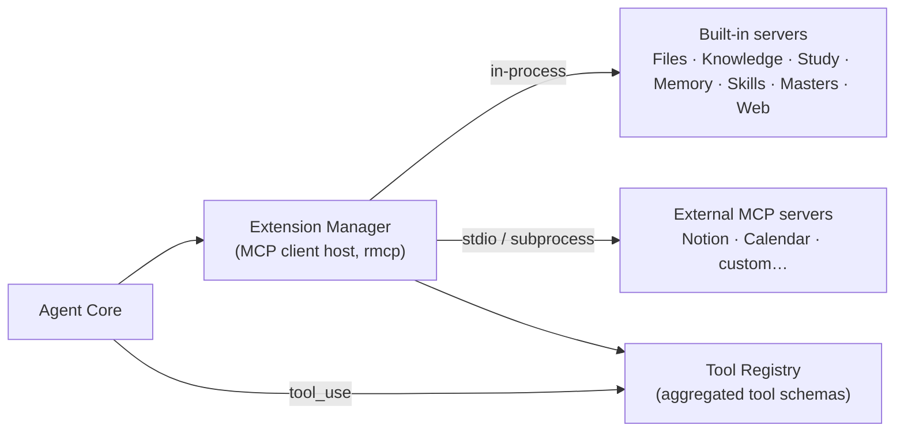
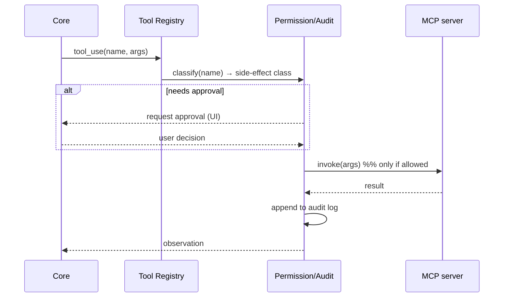

# 04 — Extensions & MCP

Masters's capabilities come from **tools**, and tools come from **MCP servers**. This mirrors Goose: the agent
core is small; almost everything it can *do* is an extension. Masters ships a study/work-focused set of built-in
servers and can host any external MCP server.

## 1. Extension model



- The **Extension Manager** is an MCP *client host* (built on `rmcp`). It connects to each enabled server,
  discovers its tools/resources, and aggregates them into a **Tool Registry**.
- The agent core sees a flat list of tools (name, description, JSON schema) and chooses among them; the manager
  routes each `tool_use` to the owning server and returns the observation.
- **Built-in** servers run in-process for speed and tight permission integration. **External** servers run as
  subprocesses over stdio (standard MCP transport) so the ecosystem of existing servers works unchanged.
- Every tool call is classified by side-effect class and passes through **Permission & Audit** before execution
  (see [06 — Security](./06-security-privacy.md)).

## 2. Built-in MCP servers

These replace Goose's developer-centric set (shell, code analysis) with study/work tools.

### 2.1 Files
The core Cowork-style capability: act on the user's documents — strictly within granted folders.

| Tool | Side-effect class | Notes |
|---|---|---|
| `list` / `search` | read | glob + content search within grant |
| `read` | read | text + extracted text from PDFs/DOCX |
| `create` | write | new file; approval required |
| `edit` | write | shows a diff preview before applying |
| `move` / `rename` | write | approval per operation (batchable) |
| `delete` | destructive | always explicit approval; soft-delete to trash where possible |

### 2.2 Knowledge (RAG)
Turns a project's documents into a grounded, citable knowledge base.

| Tool | Class | Notes |
|---|---|---|
| `ingest` | write (index) | chunk + embed files into the project index |
| `search` | read | semantic + keyword retrieval; returns chunks with source + location |
| `answer` | read | retrieve-then-answer with inline citations |
| `status` | read | index freshness, document/chunk counts |

Pipeline detail lives in [05 — Data/Storage/RAG](./05-data-storage-rag.md).

### 2.3 Study
| Tool | Class | Notes |
|---|---|---|
| `make_flashcards` | write | generate Q/A or cloze cards from selected material |
| `review_session` | read/write | serve due cards (SM-2), record grades, reschedule |
| `study_plan` | write | produce an adaptive plan toward a target date |

### 2.4 Memory
Durable per-project facts and preferences ("project memory," like Cowork). Memory is **layered** (facts vs
preferences vs procedural) and **file-backed** — `MEMORY.md`/`USER.md` are the editable source of truth, indexed
in the DB for recall ([ADR-0007](./adr/0007-layered-memory-prompt.md)).

| Tool | Class | Notes |
|---|---|---|
| `remember` | write | store a typed fact/preference scoped to a project (or global); writes to the memory file |
| `recall` | read | retrieve relevant memories for the current context (FTS + semantic) |
| `forget` | write | remove a memory |
| `curate` | write | the "nudge": propose what to persist/forget after a task, avoiding memory bloat |

The Agent Core reads these layers when it **assembles the prompt** (defaults + project `INSTRUCTIONS.md` + memory
layers + recalled skills + RAG context), so personalization is a matter of editing files, not code.

### 2.5 Skills (procedural memory)
The agent's *learned how-to* knowledge — distinct from declarative Memory and from human-authored Recipes
([ADR-0006](./adr/0006-skills-procedural-memory.md)). Each skill is an editable Markdown file (procedure +
pitfalls + verification steps), portable and importable; an imported skill is **instructions, not trusted code**
— every side-effecting step it drives still passes through Permission & Audit.

| Tool | Class | Notes |
|---|---|---|
| `recall_skill` | read | surface relevant skills into context at task start |
| `create_skill` | write | capture a reusable procedure after a successful complex task |
| `improve_skill` | write | refine a skill when a better approach is found |
| `list_skills` | read | enumerate available skills (project + global) for browsing/management |

### 2.6 Web/Browser (optional connector)
| Tool | Class | Notes |
|---|---|---|
| `fetch` | network | fetch + extract readable content from a URL (approval-gated) |
| `search` | network | optional web search via a configured provider |

### 2.7 Masters
Manage **master personas and Master Teams** — a master is a *persona over a Skill* (§2.5), a Master Team is a
group of masters + a master router ([ADR-0010](./adr/0010-master-team-orchestration.md), [09](./09-projects-masters.md)).
Each master is an editable Markdown file (`masters/*.md`), portable and importable; an imported master is
**instructions, not trusted code** — every step its subagent drives still passes Permission & Audit.

| Tool | Class | Notes |
|---|---|---|
| `list_masters` | read | enumerate masters/teams (project + global) for browsing/management |
| `create_master` | write | author a persona (allowed skills/tools, default model, output contract) |
| `improve_master` | write | refine a persona or its allowed-skills/tools |
| `route_brief` | read | the router: rank/select master(s)/team for a brief — **returns a selection, executes nothing** |

> **Routing recommends; the Core orchestrates.** `route_brief` is read-only — it only proposes which
> master(s)/team fit a brief. **Orchestration execution** (spawning master subagents, gating each tool call,
> merging results) lives in the **Agent Core**, not in this server, because subagent spawning and Permission &
> Audit are Core concerns ([02 §3](./02-architecture.md), [ADR-0008](./adr/0008-agent-isolation-parallelism.md)).
> This keeps the trust boundary unambiguous: no MCP tool can fan out work that skips approval.

## 3. External MCP servers

Users can add any MCP server (e.g. Notion, Google Calendar, a custom company tool) through Settings:

```jsonc
// Conceptual config shape (stored locally; secrets go to the OS keychain, not here)
{
  "extensions": {
    "notion": {
      "command": "npx",
      "args": ["-y", "@modelcontextprotocol/server-notion"],
      "env": { "NOTION_TOKEN": "${keychain:notion}" },
      "enabled": true
    }
  }
}
```

On enable, the Extension Manager spawns the subprocess, performs the MCP handshake, registers its tools, and
applies the same permission/audit gating as built-ins.

> **External MCP server vs. external ACP master agent.** Don't conflate the two external-process features.
> An external **MCP server** (here) is a *tool* Masters's own agent loop calls; it's narrow and
> **env-stripped** ([ADR-0008](./adr/0008-agent-isolation-parallelism.md)). An external **ACP master agent**
> ([ADR-0014](./adr/0014-external-acp-master-agents.md), [09 §2a](./09-projects-masters.md)) is a whole
> *coding-agent loop* (Claude Code/Codex/OpenCode/Gemini) that Masters **drives** as an ACP client; its
> file/permission **callbacks** route back through the same gate, and it inherits a real environment because
> it's a trusted, user-installed agent. MCP = a tool we call; ACP master = an agent we drive.

## 4. Recipes (declarative workflows)

Recipes are parameterized, repeatable multi-step tasks — the Goose concept, retargeted to study/work. They make
"do this exact thing again" a one-click or scheduled action.

> **Recipes vs Skills.** A Recipe is *human-authored, explicitly parameterized, and deterministic* (ideal for
> scheduling); a [Skill](#25-skills-procedural-memory) is *agent-learned procedure that self-improves*. A mature
> skill can be **promoted into a Recipe** when the user wants determinism and a fixed parameter contract.
> Likewise, a proven **Master-Team workflow** (§2.7, [ADR-0010](./adr/0010-master-team-orchestration.md)) can be
> promoted into a Recipe — the same promotion pattern — to make a routed multi-master run deterministic and
> scheduleable.

```yaml
# recipes/weekly-inbox-digest.yaml
name: weekly-inbox-digest
title: Weekly Inbox Digest
description: Summarize new files in the Inbox folder into a dated brief.
parameters:
  - key: inbox
    description: Folder to scan
    default: "~/Inbox"
prompt: |
  List files added to {{inbox}} in the last 7 days. Read each, then create
  "{{inbox}}/digests/digest-{{date}}.md" summarizing the key points grouped by topic.
extensions: [files, knowledge]
```

- **Parameters** are substituted at run time; **prompt** seeds the agent loop; **extensions** declares which
  servers must be enabled.
- Recipes can be run on demand or attached to the **Scheduler** (one-off or cron) — see
  [01 PRD FR-16/17](./01-product-requirements.md#35-automation) and [08 — Roadmap](./08-roadmap.md).

## 5. Tool-call lifecycle (end to end)



This uniform path means **adding a new tool never bypasses permissions or auditing** — a key safety property
for a local agent that touches files and the network.
