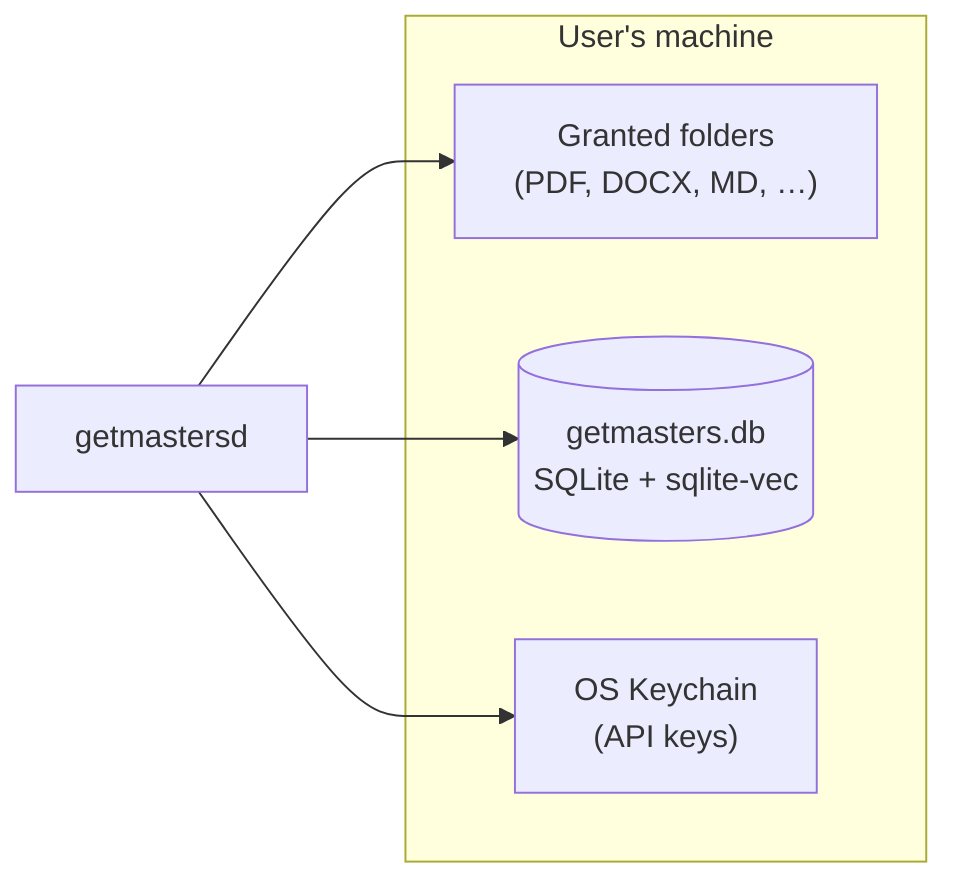
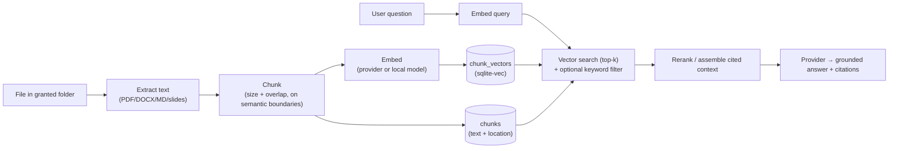

# 05 — Data, Storage & RAG

All Masters state lives in a **single local SQLite database** (with the `sqlite-vec` extension for vector
search) plus the user's own files on disk. No external database or service is required (NFR-1, NFR-6).

## 1. Storage overview



- **`getmasters.db`** — app data directory (e.g. `%APPDATA%/getmasters` on Windows, `~/Library/Application Support/getmasters`
  on macOS, `~/.local/share/getmasters` on Linux).
- **User files** — never copied wholesale into the DB; only extracted text chunks + embeddings are stored for
  RAG. The originals stay where they are.
- **Memory, skill & master files** — durable memory (`MEMORY.md`, `USER.md`), skills (`skills/*.md`), and
  master personas (`masters/*.md`) live as user-editable Markdown **alongside the project** and are the source
  of truth; `getmasters.db` holds only their derived index/FTS/embeddings ([ADR-0006](./adr/0006-skills-procedural-memory.md),
  [ADR-0007](./adr/0007-layered-memory-prompt.md), [ADR-0010](./adr/0010-master-team-orchestration.md)).
- **Secrets** — in the OS keychain, never in `getmasters.db` or config.

## 2. Logical schema (proposed)

> Illustrative DDL — column sets, not migration-final. IDs are UUID/text.

```sql
-- Projects: a persistent workspace
CREATE TABLE projects (
  id            TEXT PRIMARY KEY,
  name          TEXT NOT NULL,
  instructions  TEXT,                 -- per-project system prompt
  created_at    INTEGER, updated_at INTEGER
);

-- Folders granted to a project (permission scope; see doc 06)
CREATE TABLE folder_grants (
  id            TEXT PRIMARY KEY,
  project_id    TEXT REFERENCES projects(id),
  path          TEXT NOT NULL,
  access        TEXT NOT NULL,        -- 'read' | 'read_write'
  created_at    INTEGER
);

-- Sessions = one conversation thread within a project
CREATE TABLE sessions (
  id            TEXT PRIMARY KEY,
  project_id    TEXT REFERENCES projects(id),
  title         TEXT,
  created_at    INTEGER, updated_at INTEGER
);

-- Messages = turns in a session, author-attributed for the single-user group-chat
-- model (ADR-0012). `role` stays for provider protocol; `author`/`author_master_id`
-- record *who* spoke; `addressed_to` records @-mentions.
CREATE TABLE messages (
  id            TEXT PRIMARY KEY,
  session_id    TEXT REFERENCES sessions(id),
  role          TEXT NOT NULL,        -- 'user' | 'assistant' | 'tool'
  author        TEXT,                 -- 'user' | 'master' | 'system'
  author_master_id TEXT REFERENCES masters(id),  -- NULL unless author='master'
  addressed_to  TEXT,                 -- JSON: ['@all'] or master ids/names; NULL = coordinator/router decides
  content       TEXT,                 -- JSON: text + tool_use/tool_result blocks
  token_usage   INTEGER,
  created_at    INTEGER
);

-- Session participants (ADR-0012): the single-user group-chat roster = the user
-- (implicit) + the masters attached to the session/team. Mentions resolve here.
CREATE TABLE session_participants (
  session_id    TEXT REFERENCES sessions(id),
  master_id     TEXT REFERENCES masters(id),
  added_at      INTEGER,
  PRIMARY KEY (session_id, master_id)
);

-- Project memory (durable facts/preferences) — layered & file-backed (ADR-0007).
-- The MEMORY.md / USER.md files are the source of truth; rows here are the indexed projection.
CREATE TABLE memories (
  id            TEXT PRIMARY KEY,
  project_id    TEXT,                 -- NULL = global
  kind          TEXT NOT NULL,        -- 'fact' | 'preference' | 'procedure'
  key           TEXT, value TEXT,
  source        TEXT,                 -- how it was learned
  file_path     TEXT,                 -- backing markdown file (MEMORY.md / USER.md)
  created_at    INTEGER
);

-- Skills: agent-authored procedural memory (ADR-0006). Skill body lives in a markdown
-- file (procedure + pitfalls + verification); this table indexes it for recall/management.
CREATE TABLE skills (
  id            TEXT PRIMARY KEY,
  project_id    TEXT,                 -- NULL = global
  name          TEXT NOT NULL,
  summary       TEXT,                 -- what the skill does (for recall ranking)
  file_path     TEXT NOT NULL,        -- backing markdown skill file
  origin        TEXT,                 -- 'learned' | 'imported'
  revision      INTEGER,              -- bumped on improve_skill
  created_at    INTEGER, updated_at INTEGER
);

-- Masters: a persona over the Skills system (ADR-0010). The persona body lives in a
-- markdown file (masters/*.md, frontmatter + body), mirroring how skills are stored;
-- this table indexes it for recall/routing and records the policy (allowed skills/tools).
CREATE TABLE masters (
  id            TEXT PRIMARY KEY,
  project_id    TEXT,                 -- NULL = global
  name          TEXT NOT NULL,
  summary       TEXT,                 -- what the master does (for router ranking)
  persona_path  TEXT NOT NULL,        -- backing markdown persona file (masters/*.md)
  default_model TEXT,                 -- provider-qualified model ref, e.g. 'anthropic:claude-opus-4-8' /
                                      -- 'ollama:llama3'; persona-fixed (ADR-0003, ADR-0013)
  allowed_skills TEXT,                -- JSON array of skill names this master may use
  allowed_tools TEXT,                 -- JSON array: least-privilege tool allow-list
  output_contract TEXT,              -- expected deliverable shape/format
  origin        TEXT,                 -- 'builtin' | 'learned' | 'imported'
  revision      INTEGER,              -- bumped on improve_master
  created_at    INTEGER, updated_at INTEGER
);

-- Master Teams: a group of masters + a master-router config (ADR-0010). The bundle
-- (masters + router) is file-backed for portability; this table indexes it.
CREATE TABLE master_teams (
  id            TEXT PRIMARY KEY,
  project_id    TEXT,                 -- NULL = global
  name          TEXT NOT NULL,
  summary       TEXT,                 -- for router ranking / browsing
  router_config TEXT,                 -- JSON: routing strategy / rules
  coordinator_master_id TEXT REFERENCES masters(id),  -- answers unaddressed messages (ADR-0012)
  file_path     TEXT,                 -- backing team bundle file
  origin        TEXT,                 -- 'builtin' | 'learned' | 'imported'
  created_at    INTEGER, updated_at INTEGER
);

-- Master workflows (ADR-0012): a declarative, recipe-style ordering of master steps that
-- post attributed messages into a session; each step's output feeds the next (extends the
-- sequential chaining of ADR-0010). File-backed for portability / promote-to-Recipe.
CREATE TABLE master_workflows (
  id            TEXT PRIMARY KEY,
  project_id    TEXT,                 -- NULL = global
  team_id       TEXT REFERENCES master_teams(id),
  name          TEXT NOT NULL,
  summary       TEXT,
  steps         TEXT,                 -- JSON: ordered [{master, input_from, branch_if}] (linear + simple branching)
  max_rounds    INTEGER,              -- loop-safety cap on master<->master rounds (default 1)
  file_path     TEXT,                 -- backing YAML (portable; promotable to a Recipe)
  origin        TEXT,                 -- 'builtin' | 'learned' | 'imported'
  created_at    INTEGER, updated_at INTEGER
);

-- Team membership (join): which masters belong to a team, and their order in a
-- sequential (staged) workflow — trigger→collection→processing→output.
CREATE TABLE master_team_members (
  team_id       TEXT REFERENCES master_teams(id),
  master_id     TEXT REFERENCES masters(id),
  role          TEXT,                 -- the master's role in this team
  stage         INTEGER,              -- ordinal for sequential chaining (NULL = parallel)
  PRIMARY KEY (team_id, master_id)
);

-- Project-scoped MCP connector enablement (ADR-0011): which built-in/external MCP
-- servers are active for a project, without enabling them globally.
CREATE TABLE project_connectors (
  project_id    TEXT REFERENCES projects(id),
  extension_name TEXT NOT NULL,       -- e.g. 'notion', 'calendar', 'files'
  enabled       INTEGER,              -- 0/1
  PRIMARY KEY (project_id, extension_name)
);

-- Project templates (ADR-0011): portable pre-seed bundles (instructions + recommended
-- masters/team + skill set + connectors). File-backed like recipes; this table indexes them.
CREATE TABLE project_templates (
  id            TEXT PRIMARY KEY,
  name          TEXT NOT NULL,
  summary       TEXT,
  file_path     TEXT NOT NULL,        -- backing template manifest
  created_at    INTEGER
);

-- RAG: documents and their chunks
CREATE TABLE documents (
  id            TEXT PRIMARY KEY,
  project_id    TEXT REFERENCES projects(id),
  path          TEXT NOT NULL,
  content_hash  TEXT NOT NULL,        -- detects changes for re-index
  mime          TEXT, indexed_at INTEGER
);
CREATE TABLE chunks (
  id            TEXT PRIMARY KEY,
  document_id   TEXT REFERENCES documents(id),
  ordinal       INTEGER,
  text          TEXT NOT NULL,
  location      TEXT                  -- e.g. page/heading for citations
);

-- Vector index (sqlite-vec virtual table), keyed to chunks.id
CREATE VIRTUAL TABLE chunk_vectors USING vec0(
  chunk_id TEXT PRIMARY KEY,
  embedding FLOAT[768]               -- dim depends on the embedding model
);

-- Study: flashcards + SM-2 review state
CREATE TABLE flashcards (
  id            TEXT PRIMARY KEY,
  project_id    TEXT REFERENCES projects(id),
  front TEXT, back TEXT,
  ease REAL, interval_days INTEGER, due_at INTEGER,  -- SM-2 fields
  source_chunk  TEXT REFERENCES chunks(id)
);

-- Audit log (every side-effecting tool call; see doc 06)
CREATE TABLE audit_log (
  id            TEXT PRIMARY KEY,
  session_id    TEXT,
  author_master_id TEXT REFERENCES masters(id),  -- which master drove the call (NULL = singular agent/user), ADR-0012
  tool          TEXT NOT NULL,
  args          TEXT,                 -- JSON (redacted secrets)
  decision      TEXT,                 -- 'auto' | 'approved' | 'denied'
  result_summary TEXT,
  created_at    INTEGER
);

-- Full-text search (SQLite FTS5) for hybrid retrieval over text Masters owns:
-- chunks, messages, memories, skills, masters, and master teams (the last two so the
-- router can rank them). Author-attributed messages (ADR-0012) are recallable per author
-- for long-transcript recall. Pairs with sqlite-vec for vector+keyword recall.
CREATE VIRTUAL TABLE search_fts USING fts5(
  body,                              -- indexed text
  kind UNINDEXED,                    -- 'chunk' | 'message' | 'memory' | 'skill' | 'master' | 'master_team'
  ref_id UNINDEXED                   -- row id in the owning table
);
```

## 3. RAG pipeline



### Ingestion
1. **Extract** text per file type (PDF text layer, DOCX, Markdown, plain text, slide notes). Record
   `content_hash` so unchanged files are skipped on re-index.
2. **Chunk** with overlap, preferring semantic boundaries (headings/paragraphs); keep a `location` (page,
   heading) per chunk for citations.
3. **Embed** each chunk via the configured embedding model (Claude/OpenAI embeddings, or a local model for
   fully-offline use). Store vector in `chunk_vectors`.
4. **Incremental re-index**: on file change (hash mismatch) re-ingest only affected documents; surface index
   freshness via `Knowledge.status` (FR-11).

### Retrieval & answering
1. Embed the query; run **top-k** vector search in `sqlite-vec`, optionally combined with a keyword/FTS filter
   (hybrid retrieval).
2. Assemble retrieved chunks (with their `location`) into the prompt context.
3. The model answers **with inline citations** back to file + location; the UI renders them as clickable
   references (FR-10).
4. If retrieval is empty/low-confidence, the agent says so and offers a non-grounded answer explicitly labeled
   as such (design principle: *grounded over generative*).

## 4. Sizing & performance notes

- **Personal scale** (hundreds–low-thousands of documents) fits SQLite + `sqlite-vec` comfortably; brute-force
  / ANN search over that volume is sub-second on commodity hardware.
- **Upgrade path:** if a library grows beyond comfortable in-SQLite search, swap the vector layer for **LanceDB**
  behind the same `Knowledge` interface — only the vector store implementation changes ([ADR-0004](./adr/0004-vector-store.md)).
- **Backups:** the whole app state is one file (`getmasters.db`) plus the keychain entry — trivial to back up; user
  documents are untouched in place.

## 5. Data retention & deletion

- Deleting a **project** cascades to its sessions (and their participants), messages, documents, chunks,
  vectors, flashcards, memories, skills, masters, master teams (and memberships), project-scoped master
  workflows, and project connectors (including their backing `MEMORY.md`/`USER.md`/`skills/*.md`/`masters/*.md`
  files) — but never deletes the user's source documents. Project templates and global master workflows are
  portable artifacts and are **not** removed by a project delete.
- Sessions and audit entries can be individually deleted/exported.
- See [06 — Security & Privacy](./06-security-privacy.md) for the privacy boundary and what leaves the device.
