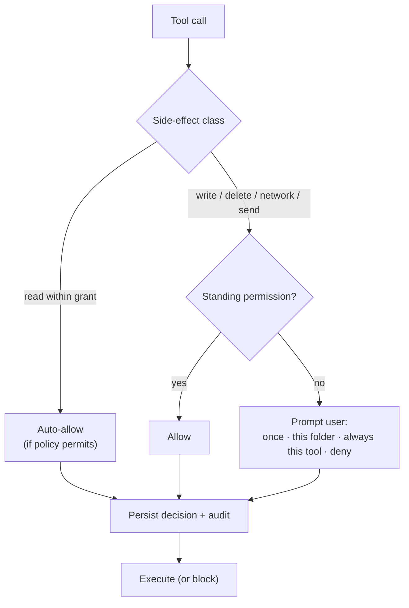
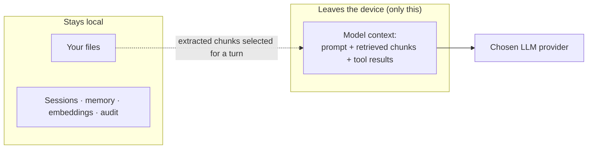

# 06 — Security & Privacy

Masters is an agent that can **read, write, and delete files** and **reach the network**. Trust is therefore a
*first-class architectural concern*, not an afterthought — this is the main place Masters invests beyond Goose.

## 1. Threat model (what we protect against)

| Threat | Mitigation |
|---|---|
| Agent touches files outside what the user intended | **Folder-scoped grants** — file tools physically cannot act outside granted paths |
| Agent makes a surprising destructive/irreversible change | **Per-action approvals** + diff preview + soft-delete/revert |
| Another local process drives the agent | Daemon binds **loopback only** + per-launch **auth token** |
| API keys leak from disk | Secrets in **OS keychain**, redacted in logs |
| User can't tell what the agent did | **Append-only audit log** of every side-effecting call |
| Sensitive data silently sent to a cloud model | Explicit, visible **privacy boundary**; local model option |
| **Per-master cloud model** widens/forks the privacy surface | In a multi-master session the boundary is **per-master**: each master's provider is shown; local-model masters stay on-device; fully-local mode keeps every master on-device ([ADR-0013](./adr/0013-per-master-model.md)) |
| Malicious/over-broad external MCP server | Same permission gating as built-ins; **sandboxed subprocess + credential stripping**; servers are user-added and visible |
| Prompt injection via ingested documents | Tool-call gating means injected "instructions" still can't execute writes without approval |
| Imported/shared **Skill** carries unsafe steps | A skill is *instructions, not trusted code* — every step it drives still passes Permission & Audit; skill origin (`learned`/`imported`) is shown |
| Imported/shared **Master/Team** carries unsafe persona/steps | A master is *instructions, not trusted code* — every step its subagent drives still passes Permission & Audit; master origin (`builtin`/`learned`/`imported`) is shown ([ADR-0010](./adr/0010-master-team-orchestration.md)) |
| **Master-team fan-out** aggregates many gated actions | Each master subagent runs under the same per-action gating; parallelism never aggregates calls in a way that bypasses approval ([ADR-0008](./adr/0008-agent-isolation-parallelism.md)) |
| **Master↔master reply loop** (runaway multi-agent chatter) | Masters don't auto-reply; they speak only when @-addressed, workflow-ordered, or coordinator/router-selected; bounded `max_rounds`; the user holds the floor and Stop halts the group ([ADR-0012](./adr/0012-multi-master-conversation.md)) |
| **`@all` fan-out cost** (every master answers each turn) | Mention-scoping is the primary lever; coordinator-default for unaddressed turns; bounded parallelism ([ADR-0012](./adr/0012-multi-master-conversation.md)) |
| Over-broad default capabilities | **Blank Slate / least-privilege mode**: minimal default tools, no standing permissions; capability granted as needed |
| Scheduled output silently emailed off-device | Email digest is a `send` action — **off by default**, approval-gated, redaction-aware, with a visible privacy boundary |

## 2. Permission model

**Side-effect classes:** `read`, `write`, `destructive` (delete/overwrite), `network`, `send` (external
side-effects like posting to Notion).

**Grant granularity:**
- **Folder grants** scope all `Files`/`Knowledge` operations to chosen directories with `read` or `read_write`
  access (stored in `folder_grants`, doc 05).
- **Standing permissions** let users reduce friction: *allow once*, *allow for this folder*, *always allow this
  tool*. Destructive and `send` actions can be configured to **never** be auto-approved.
- Defaults are conservative: reads inside a grant may auto-allow; **writes/deletes/network always prompt** until
  the user grants standing permission.
- **Blank Slate / least-privilege mode** ([ADR-0008](./adr/0008-agent-isolation-parallelism.md)): a session or
  profile can boot with a minimal default tool set and no standing permissions, granting capability incrementally
  — the conservative posture for sensitive work, on top of folder grants.

### Default policy matrix (out-of-the-box)

This resolves the previously-open question of what auto-allows by default:

| Side-effect class | Default | Standing permission allowed? |
|---|---|---|
| `read` (inside a grant) | **auto-allow** | n/a (already allowed) |
| `read` (outside any grant) | **deny** (no grant, no access) | only by adding a folder grant |
| `write` | **prompt** (with diff preview) | once / folder / always |
| `destructive` (delete/overwrite) | **prompt** (soft-delete to trash) | once / folder; *always* is opt-in and discouraged |
| `network` (e.g. web fetch) | **prompt** | once / always |
| `send` (email, external post) | **prompt**, never silently | once only by default; *always* is opt-in per target |

Blank Slate mode tightens this further by withholding tools until explicitly enabled.

## 3. Network & process isolation

- **getmastersd** binds to `127.0.0.1` on an ephemeral port and requires a **per-launch bearer token** that the
  desktop generates and passes on every HTTP/WS call. Other local apps can't connect blindly.
- **External MCP servers** run as child processes Masters supervises, **sandboxed where the OS allows** and with
  **credential stripping** — they inherit only the env Masters explicitly injects (secrets resolved from the
  keychain at spawn, not stored in config files), never the parent's full environment ([ADR-0008](./adr/0008-agent-isolation-parallelism.md)).
- **Parallel subagents** spawned for concurrent work — including **master subagents** spawned by Master-Team
  orchestration ([ADR-0010](./adr/0010-master-team-orchestration.md)) — run under the same permission/audit
  gating as the parent; parallelism never aggregates tool calls in a way that bypasses approval.
- v1 runs only while the app is open. A future opt-in background service (for the Scheduler) would document its
  own expanded surface before shipping.

## 4. Secrets

- API keys and external-service tokens are stored in the **OS keychain** (`keyring` crate): Windows Credential
  Manager, macOS Keychain, Linux Secret Service.
- Config files reference secrets indirectly (e.g. `${keychain:notion}`); plaintext secrets never hit disk.
- Audit logs and transcripts **redact** secret-shaped values.
- **Data at rest** lives under the per-user data home **`~/.getmasters`** (the SQLite DB + per-project
  Markdown memory/skills/recipes/masters), created on first run. Override with `GETMASTERS_HOME`
  (or `GETMASTERS_DB_PATH` for an explicit DB file).

## 5. The privacy boundary (what leaves the device)

- **Stored locally, always:** your files, embeddings/index, sessions, memory, audit log.
- **Leaves the device, only when you run a turn:** the *model context* — the prompt plus whatever retrieved
  chunks/tool results are needed — sent to the **provider you configured**.
- This boundary is **visible**: the UI can show what context is being sent, and a **fully-local mode** (Ollama +
  local embeddings) keeps even the model context on-device for sensitive work.
- **Per-master boundary** ([ADR-0013](./adr/0013-per-master-model.md)): when masters run on different models,
  each master's turn goes to *its* provider — so a shared group transcript may reach **multiple providers** (one
  per responding master), while a **local-model master keeps its context on-device**. The UI surfaces each
  master's provider/boundary; fully-local mode keeps every master on-device.
- **Outbound delivery** ([ADR-0009](./adr/0009-outbound-delivery-surfaces.md)) is the only *other* path off the
  device: OS notifications stay on-device, while an opt-in **email digest** sends routine output to a
  user-configured address — a `send` action that is off by default, approval-gated, redaction-aware, and shows
  exactly what leaves before it goes.
- Masters itself has **no telemetry backend** in the local-first design; any opt-in analytics would be
  explicit and off by default.

## 6. Audit & reversibility

- **Audit log** (`audit_log`, doc 05): every side-effecting tool call records tool, redacted args, the
  decision (`auto`/`approved`/`denied`), a result summary, and timestamp — plus, in a multi-master session, the
  **authoring master** (`author_master_id`) so each action is attributable to the persona that drove it
  ([ADR-0012](./adr/0012-multi-master-conversation.md)). Viewable and exportable (FR-22).
- **Reversibility:** file edits show a **diff preview** before applying and support **revert last action**;
  deletes prefer **soft-delete to trash** so mistakes are recoverable (FR-8).

## 7. Supply-chain & code integrity

- Dependencies pinned via `Cargo.lock` / `pnpm-lock.yaml`; routine `cargo audit` / `pnpm audit` in CI.
- Releases are signed/notarized per platform (Windows, macOS) so users can verify authenticity.
- External MCP servers are user-installed and listed in Settings; Masters surfaces what each can do
  (its tool list and side-effect classes) before enabling.

## 8. Open security questions (to resolve during build)

- ~~Exact default policy matrix per side-effect class~~ — **resolved** (see §2, "Default policy matrix";
  [ADR-0008](./adr/0008-agent-isolation-parallelism.md)).
- Depth of OS-level sandboxing achievable for external MCP subprocesses per platform.
- Whether the background Scheduler service ships in v2 and its hardening requirements (it would expand the
  outbound-delivery surface, [ADR-0009](./adr/0009-outbound-delivery-surfaces.md)).
- Handling of embedded active content in ingested files (e.g. macros) during extraction.
- Trust signals/provenance for **imported skills** — and **imported masters/teams** — from a community hub
  (review UX before enable, [ADR-0010](./adr/0010-master-team-orchestration.md)).
- Cost/rate bounds on **Master-Team fan-out** (parallel masters multiply provider calls); default to
  single-master/manual and bound parallelism ([ADR-0010](./adr/0010-master-team-orchestration.md)).
