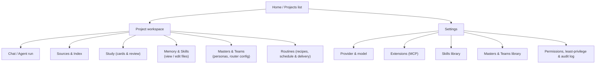
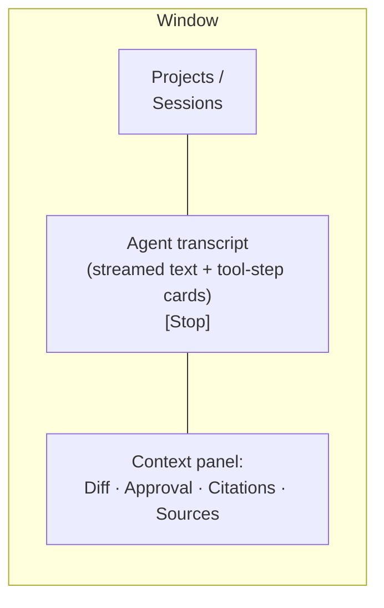
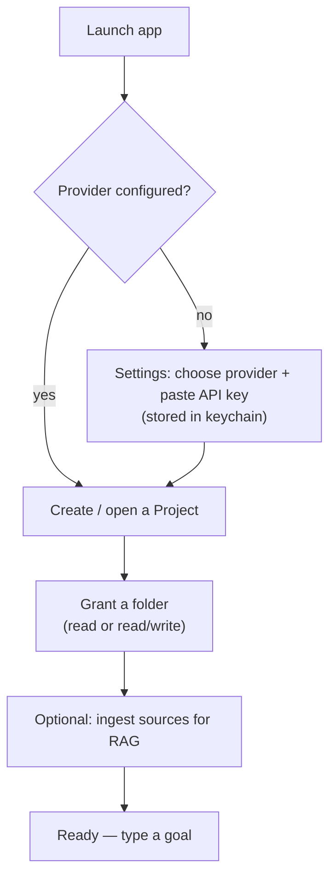
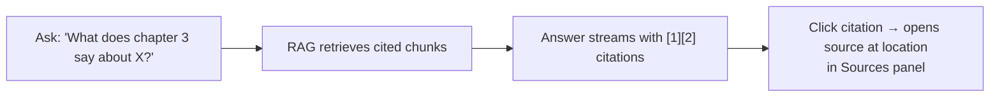
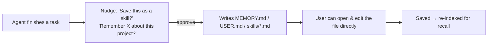
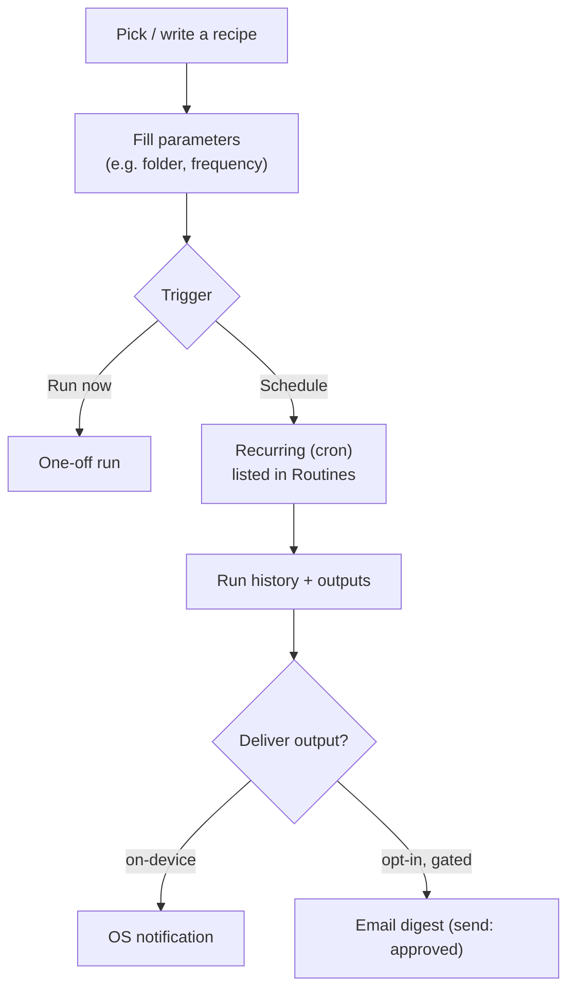
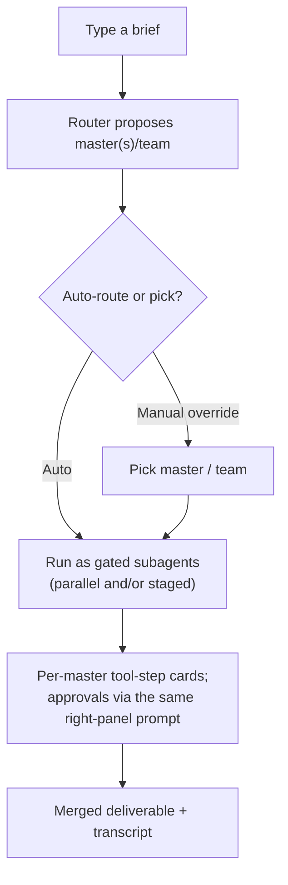
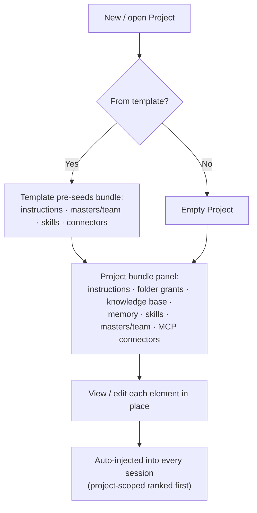

# 07 — UX Flows

This document sketches Masters's key screens and the flows that connect them. It is intentionally
implementation-agnostic (wireframe-level), describing structure and interaction, not pixel design.

## 1. Information architecture



## 2. Primary screen: Project workspace + Chat

The default working surface. Three regions:

- **Left rail** — projects, sessions within the active project, quick "new task."
- **Center** — the **chat/agent transcript**: streamed assistant text interleaved with **tool-step cards**
  (e.g. "Read 12 files", "Proposed 8 renames"), each expandable to show inputs/outputs.
- **Right panel (contextual)** — switches to show a **diff preview**, an **approval prompt**, retrieved
  **citations**, or the **sources index**, depending on what the agent is doing.



## 3. Flow: first run & granting a folder



Folder grant is an explicit OS folder-picker action; the granted scope is shown as a chip in the project header
and is editable/revocable in Settings → Permissions.

## 4. Flow: an agent task with approvals

```mermaid
sequenceDiagram
    participant U as User
    participant Chat
    participant Agent
    U->>Chat: "Sort and dedupe my Downloads"
    Agent-->>Chat: Plan + reads files (auto within grant)
    Agent-->>Chat: Tool-step card: "Proposes 8 moves, 2 deletes"
    Chat-->>U: Approval prompt (right panel)\n[Allow once] [Allow for folder] [Deny]
    U->>Chat: Allow once
    Agent-->>Chat: Executes; cards show results
    Chat-->>U: Done + "Revert last action" available
```

Key UX rules:
- The user can **Stop** at any time (FR-3).
- Writes show a **diff/preview**; deletes prefer **trash** with **revert** (FR-8).
- Approval choices include standing options to cut future friction.

## 5. Flow: grounded Q&A (study)



If no relevant sources are found, the answer is **labeled non-grounded** and offers to ingest more material.

## 6. Flow: study tools

- **Make flashcards** — select material (a document, a chapter, or "this project") → review the generated deck
  → save to project.
- **Review session** — a focused mode serving **due** cards (SM-2); grade each (again/hard/good/easy); next due
  dates update; progress shown.
- **Study plan** — enter a target date → get a day-by-day plan emphasizing weak areas → optionally schedule
  reminders as routines.

## 7. Flow: memory & skills (transparent, editable)



- **Memory & Skills** panel shows the project's `MEMORY.md`, `USER.md`, and skill files — readable, editable,
  and removable in place ([ADR-0007](./adr/0007-layered-memory-prompt.md)).
- The **Skills library** (Settings) lists learned + imported skills; each shows its origin (`learned`/`imported`)
  and lets the user edit, disable, import/export, or **promote a skill into a Recipe**.

## 8. Flow: routines (recipes + scheduler + delivery)



v1 routines fire while the app is open; the Routines screen shows next-run time, past results, and the chosen
**delivery** channel. Email delivery is off by default and approval-gated ([ADR-0009](./adr/0009-outbound-delivery-surfaces.md)).

## 9. Settings

- **Provider & model** — choose provider, default model, embedding model; key stored in keychain.
- **Extensions (MCP)** — toggle built-ins (Files, Knowledge, Study, Memory, Skills, Masters, Web); add external
  MCP servers (command/args/env); see each server's tool list and side-effect classes.
- **Skills library** — browse/edit/enable learned + imported skills; import/export; promote to a Recipe.
- **Masters & Teams library** — browse/edit/enable masters and Master Teams (origin shown); import/export
  portable bundles; promote a proven team to a Recipe ([ADR-0010](./adr/0010-master-team-orchestration.md)).
- **Permissions, least-privilege & audit** — manage folder grants and standing permissions; toggle **Blank
  Slate** least-privilege mode; review the **default policy matrix**; browse/export the **audit log**.

## 10. Accessibility & platform fit

- Keyboard-first navigation; visible focus; screen-reader labels on tool-step cards and approvals.
- Native OS folder pickers, keychain prompts, and notifications (via Tauri).
- Optional **voice kickoff** for hands-free study sessions (mic permission prompted on first use).
- Light/dark themes following the OS.

## 11. Flow: master teams & routing



- The router's pick is always **overridable** — the user can choose a different master/team or a single master
  ([FR-40](./01-product-requirements.md)).
- Each master runs as an isolated subagent; its side-effecting tool calls surface in the **same approval UI**
  as any other action — orchestration never bypasses gating ([ADR-0010](./adr/0010-master-team-orchestration.md),
  [06 §2](./06-security-privacy.md)).
- A team workflow that proves out can be **promoted to a Recipe** for determinism/scheduling.

## 12. Flow: project bundle & templates



- The **Project bundle panel** lets the user view/edit the whole context container in one place (mirrors the
  Memory & Skills panel, §7), and create a Project **from a template** ([FR-7](./01-product-requirements.md),
  [FR-42](./01-product-requirements.md), [ADR-0011](./adr/0011-project-context-container.md)).

## 13. Flow: multi-master group chat & workflow

A multi-master session reads as a **group chat** (a single-user metaphor —
[ADR-0012](./adr/0012-multi-master-conversation.md)).

```mermaid
flowchart TB
    Msg["Type a message\n@-mention autocomplete + [@all] chip"] --> Addr{"Addressed?"}
    Addr -->|@one / @several / @all| Sel["Named masters respond"]
    Addr -->|no mention| Coord["Coordinator master responds\n(may delegate; router as assist)"]
    Addr -->|run workflow| Wf["Workflow steps run in order\n(output feeds next)"]
    Sel --> Cards
    Coord --> Cards
    Wf --> Cards["Attributed per-master message cards;\nper-master tool calls use the same approval prompt"]
    Cards --> Group["Merged into the shared transcript"]
```

Key UX rules:
- **@-mention autocomplete** resolves against the session's participant masters; `@all`/`@team` addresses
  everyone ([FR-43](./01-product-requirements.md)).
- Replies render as **attributed per-master cards** (name + origin badge), distinct from tool-step cards; each
  master's side-effecting tool calls still surface in the **same right-panel approval** prompt (§4) — no gating
  bypass.
- A small **workflow builder/runner** lets the user order master steps (with a `max_rounds` cap), **Run now** or
  **Schedule**, and **Promote to a Recipe** ([FR-45](./01-product-requirements.md)).
- Masters never auto-chatter; **Stop ([FR-3](./01-product-requirements.md)) halts the whole group**, and the
  user always holds the floor.

These flows trace directly to the functional requirements in [01 — PRD](./01-product-requirements.md) and the
permission model in [06 — Security](./06-security-privacy.md).
