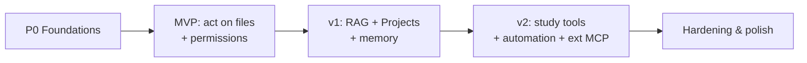

# 08 — Roadmap

Phased delivery. Each phase is independently useful and validates the layer beneath it. Priorities (P0/P1/P2)
match the [PRD](./01-product-requirements.md).

## Phase 0 — Foundations (engineering setup)

Goal: a buildable skeleton with the architecture's seams in place.

- Cargo workspace: `getmasters-core`, `getmasters-server` (`getmastersd`), `getmasters-mcp`, `getmasters-proto` (+ optional
  `getmasters-cli`).
- Tauri 2 + React + TypeScript desktop shell; spawns and health-checks `getmastersd` (loopback + auth token).
- OpenAPI description + generated TS client; one end-to-end "ping" round-trip.
- SQLite store with migrations; `Provider` trait with a Claude implementation.

**Exit criteria:** desktop launches daemon, sends a prompt to Claude, streams a reply.

## Phase 1 — MVP: chat that acts on files (P0)

Goal: the core Cowork-like loop with safety rails.

- Agent loop with streaming + **Stop** (FR-1..3).
- **Files** MCP server (read/list/search/create/edit/move/rename/delete) scoped to **folder grants** (FR-5,6).
- **Permission & Audit**: per-action approvals, diff preview, revert, audit log, **default policy matrix +
  Blank Slate least-privilege mode** (FR-21,22,28; doc 06, [ADR-0008](./adr/0008-agent-isolation-parallelism.md)).
- **Modular prompt assembly** baseline: compose the system prompt from editable sources (FR-37; [ADR-0007](./adr/0007-layered-memory-prompt.md)).
- Settings: provider/model/API key in keychain (FR-24, FR-23 baseline).
- Extension Manager hosting built-ins via `rmcp`.

**Exit criteria:** "Sort and dedupe my Downloads" runs end to end with approvals and is fully auditable/reversible.

## Phase 2 — v1: grounded knowledge + Projects (P1)

Goal: grounding on the user's own materials + persistence.

- **Projects**: workspace = folders + instructions + memory, resumable (FR-7); enriched into a **context
  container** — bundle auto-injected into each session, **project-scoped items ranked above global**
  ([ADR-0011](./adr/0011-project-context-container.md)). (Masters/team element + templates land in Phase 3.)
- **Knowledge/RAG** server: ingest PDF/DOCX/MD/slides → chunk → embed → `sqlite-vec`; grounded Q&A **with
  citations**; incremental re-index + freshness (FR-9,10,11).
- **Memory** server with **layered, file-backed memory** (`MEMORY.md`/`USER.md`) + **curation nudge**
  (FR-35,36; [ADR-0007](./adr/0007-layered-memory-prompt.md)).
- **Skills** server: capture/improve/recall self-improving procedural memory; Skills library UI
  (FR-31,32,33,34; [ADR-0006](./adr/0006-skills-procedural-memory.md)).
- Extensions management UI: toggle built-ins (FR-19).
- Optional **CLI** over the same core (FR-26).

**Exit criteria:** ingest a course folder, ask a question, get a cited answer; reopen the app and resume the
project with memory intact; a repeated task reuses a captured Skill.

## Phase 3 — v2: study tools + automation + ecosystem (P2)

Goal: the study features and repeatable/scheduled work that differentiate Masters.

- **Study** server: flashcard generation, SM-2 review sessions, adaptive study plans (FR-13,14,15).
- **Recipes** engine (YAML workflows) + **Scheduler** (one-off + cron) (FR-16,17); Routines screen.
- **Outbound delivery**: OS notifications + opt-in email digest for routine output (FR-27; [ADR-0009](./adr/0009-outbound-delivery-surfaces.md)).
- **External MCP** servers via settings (Notion, Calendar, custom), sandboxed + credential-stripped (FR-20,29).
- **Web/Browser** connector (fetch/read) (optional).
- **Masters & Master Teams**: masters as **persona-over-Skill**, a **master router**, and orchestration via
  **gated** parallel/sequential subagents; portable master/team bundles + promote-to-Recipe (FR-38,39,40,41;
  [ADR-0010](./adr/0010-master-team-orchestration.md)). **Project templates** (FR-42;
  [ADR-0011](./adr/0011-project-context-container.md)). **Multi-master group-chat messaging** (@-mention
  addressing, shared author-attributed transcript, coordinator default, bounded turn-taking) + **declarative
  master workflows** (FR-43,44,45; [ADR-0012](./adr/0012-multi-master-conversation.md)). **Per-master model
  selection** (FR-46; [ADR-0013](./adr/0013-per-master-model.md)) — Claude-tier-per-master here; full
  cross-provider masters follow once additional providers land (Phase 4).

**Exit criteria:** generate flashcards from ingested material, run a spaced-repetition session, and schedule a
recurring "weekly inbox digest" recipe that **delivers** its output.

## Phase 4 — Hardening & polish (cross-cutting)

- Additional providers (OpenAI, Ollama/local) and a documented **fully-local mode** (local embeddings).
- **Parallel subagents** for bulk work (ingest, multi-folder scans) and **OS-level sandbox hardening** for
  external MCP servers (FR-30; [ADR-0008](./adr/0008-agent-isolation-parallelism.md)).
- Vector-store upgrade path to LanceDB for large libraries ([ADR-0004](./adr/0004-vector-store.md)).
- Cross-platform packaging/signing (Windows msi, macOS dmg notarized, Linux AppImage/deb); auto-update.
- Accessibility pass, theming, performance tuning (NFR-3,4).
- Optional opt-in background Scheduler service (with documented security review).

## Sequencing rationale

Permissions ship in the **MVP**, not later — a file-acting agent is only adoptable if it's trustworthy from day
one. RAG precedes study tools because flashcards/plans build on the knowledge index. **Skills and layered memory
land with v1**, once there are real Projects and tasks worth learning from. **Delivery, parallel subagents, and
external MCP come last** so the core, trusted experience is proven before the trust/automation surface widens.
**Masters & Master Teams land in v2** because they are built on those primitives — personas ride on Skills (v1)
and orchestration rides on parallel subagents — so they come after both exist
([ADR-0010](./adr/0010-master-team-orchestration.md)). The **multi-master conversation model** (addressing,
shared transcript, workflows) rides on the same primitives and ships alongside them
([ADR-0012](./adr/0012-multi-master-conversation.md)).

## Risks & mitigations

| Risk | Mitigation |
|---|---|
| Rust + Tauri slows solo delivery | Keep core small; lean on `rmcp` and crates; UI is conventional React |
| RAG quality disappoints | Hybrid retrieval + citations + explicit non-grounded labeling; iterate on chunking |
| Approval fatigue | Standing permissions (once/folder/always); conservative-but-tunable defaults |
| Provider cost/latency | Sonnet-tier for fast turns, Opus for heavy reasoning; local model option in P4 |
| Scope creep into a coding IDE | Non-goals enforced; Files server is generic, no code-authoring UX |
| Skills accumulate low-quality/duplicate procedures | Capture is nudge-gated + user-editable; dedup on summary; promote only proven ones to Recipes |
| Memory file ↔ DB index drift | Files are the source of truth; re-index on change; DB is rebuildable from files |
| Delivery widens the privacy/trust surface | Outbound-only; email is `send`-gated and off by default; no inbound/messaging surfaces ([ADR-0009](./adr/0009-outbound-delivery-surfaces.md)) |
| Master-team fan-out multiplies provider cost/latency | Bound parallelism; default to single-master/manual routing; use Sonnet-tier for sub-tasks ([ADR-0010](./adr/0010-master-team-orchestration.md)) |
| Master/Skill abstraction overlap | Keep a Master **thin** (persona over a Skill), not a separate heavy agent; revisit per [ADR-0010](./adr/0010-master-team-orchestration.md) |
| Project-vs-global precedence ambiguity / template drift | Define explicit project-first ranking + conflict rules in prompt assembly; reuse the Skill/Recipe portability format for bundle/template serialization ([ADR-0011](./adr/0011-project-context-container.md)) |
| Master↔master reply loops / `@all` cost | No ad-hoc auto-reply; bounded `max_rounds`; coordinator default + mention-scoping; user holds the floor, Stop halts the group ([ADR-0012](./adr/0012-multi-master-conversation.md)) |
| Per-master models fan context to multiple providers | Per-master privacy boundary is shown; local-model masters stay on-device; fully-local mode keeps all masters on-device ([ADR-0013](./adr/0013-per-master-model.md)) |
