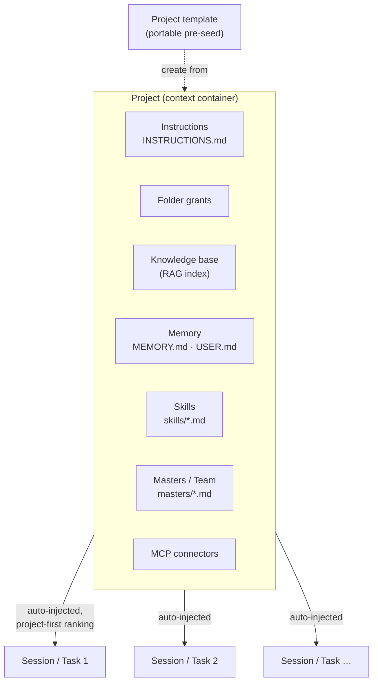
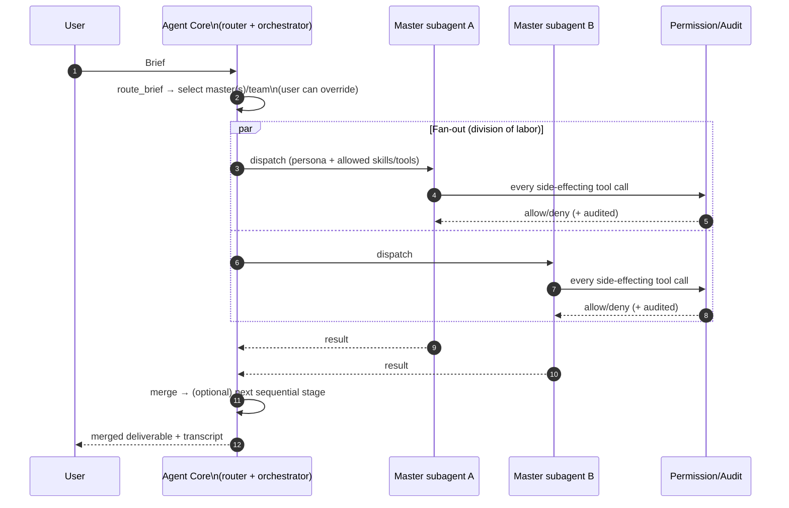
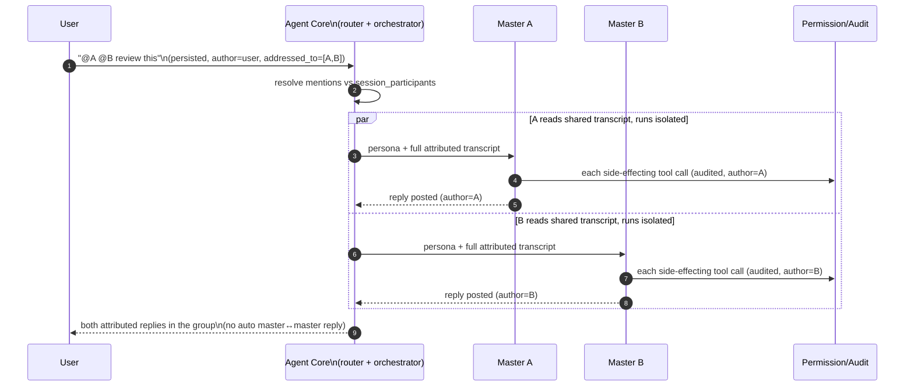

# 09 — Projects & Master Teams

A **Project** is Masters's context hub: the persistent container that bundles everything a task
needs and auto-injects it into each session. An **Master** is a persona layered on a
[Skill](./04-extensions-mcp.md#25-skills-procedural-memory); an **Master Team** is a group of
masters plus a router, run as gated parallel/sequential subagents. These ideas are adapted from
**WorkBuddy**'s Project + "master team" model, taken as a **single-user slice** — WorkBuddy's
collaboration, task sharing/handoff, member approval, and inbound messaging are deliberately
dropped ([00 non-goals](./00-overview.md), [ADR-0009](./adr/0009-outbound-delivery-surfaces.md)).
Everything here is built on existing primitives and stays under **Permission & Audit**
([ADR-0010](./adr/0010-master-team-orchestration.md), [ADR-0011](./adr/0011-project-context-container.md)).

## 1. The Project as a context container

Earlier docs grew each ingredient of a workspace independently (grants, RAG, memory, skills,
connectors). A Project unifies them: it **bundles** them and **auto-injects** the bundle into
every session ("task") created under it, with **project-scoped items ranked above global** ones
in prompt assembly and recall ([ADR-0011](./adr/0011-project-context-container.md), extending the
assembly model of [ADR-0007](./adr/0007-layered-memory-prompt.md)).

| Bundle element | Backing store | Reference |
|---|---|---|
| Instructions | `INSTRUCTIONS.md` (file) + `projects.instructions` | [ADR-0007](./adr/0007-layered-memory-prompt.md), [05](./05-data-storage-rag.md) |
| Folder grants | `folder_grants` | [05](./05-data-storage-rag.md), [06](./06-security-privacy.md) |
| Knowledge base | `documents` / `chunks` / `chunk_vectors` | [05](./05-data-storage-rag.md) |
| Memory | `MEMORY.md` / `USER.md` (files) + `memories` | [ADR-0007](./adr/0007-layered-memory-prompt.md) |
| Skills | `skills/*.md` (files) + `skills` | [ADR-0006](./adr/0006-skills-procedural-memory.md) |
| Masters / team | `masters/*.md` (files) + `masters`, `master_teams` | §2–§3, [ADR-0010](./adr/0010-master-team-orchestration.md) |
| MCP connectors | `project_connectors` | [04](./04-extensions-mcp.md) |



**Project templates.** A Project can be created from a portable **template** that pre-seeds the
bundle — instructions, a recommended master/team, a starter skill set, and the connectors a
workflow needs — the same way Skills and Recipes are portable ([04 §4](./04-extensions-mcp.md)).
Templates make common workflows ("course study", "weekly reporting") one click to stand up.

## 2. Masters — persona over Skill

An **Master** is a *thin role descriptor* layered on the Skills system
([ADR-0006](./adr/0006-skills-procedural-memory.md)) — not a separate heavyweight agent. It
selects and constrains *which* skills and tools the agent uses for a task and *how* it should
sound and format output.

| Field | Meaning |
|---|---|
| `name` / `summary` | Identity + a short description used for router ranking |
| `persona` | System-prompt fragment: the role's voice, masterise, and stance |
| `allowed_skills` | Skills this master may recall/use ([ADR-0006](./adr/0006-skills-procedural-memory.md)) |
| `allowed_tools` | Tool allow-list (a least-privilege subset, [ADR-0008](./adr/0008-agent-isolation-parallelism.md)) |
| `default_model` | Provider-qualified model ref — **any configured provider** (Claude tiers / OpenAI / local Ollama); persona-fixed ([ADR-0003](./adr/0003-llm-providers.md), [ADR-0013](./adr/0013-per-master-model.md)) |
| `output_contract` | Expected deliverable shape (e.g. a brief, a deck outline, a checklist) |
| `origin` | `builtin` / `learned` / `imported` (shown for trust) |

Masters are stored as **editable Markdown** (`masters/*.md`, YAML frontmatter + body) indexed in
`getmasters.db` for recall — **mirroring Skills storage exactly** ([05 §2](./05-data-storage-rag.md)).
An **imported master is *instructions, not trusted code*** — every step its subagent drives still
passes Permission & Audit ([06](./06-security-privacy.md)), exactly as for imported Skills.

```markdown
---
name: backend-architect
summary: Designs service architecture and reviews API/data-model decisions.
persona: A senior backend engineer; favors simple, testable designs; flags risk early.
default_model: claude-opus-4-8
allowed_skills: [api-review, schema-design]
allowed_tools: [files.read, files.search, knowledge.search, knowledge.answer]
output_contract: "A decision note: options, trade-offs, recommendation."
origin: learned
---

## How this master works
1. Read the relevant sources via Knowledge, cite them.
2. Lay out options with trade-offs.
3. Recommend one, with verification steps.
```

**Per-master models.** Each master runs on the model named in its persona's `default_model` — a
**provider-qualified** ref against any *configured* provider (Claude tiers, OpenAI, or a local
Ollama model), dispatched through the `Provider` trait ([ADR-0003](./adr/0003-llm-providers.md),
[ADR-0013](./adr/0013-per-master-model.md)). So a team/group chat can run **heterogeneous models
side by side** — a cheap/fast master on a small or local model, a heavy-reasoning master on Opus.
The model is **persona-fixed** (edit the persona to change it). This also makes the **privacy
boundary per-master**: a local-model master keeps its turn's context on-device, while a cloud-model
master sends it to that provider — surfaced per master ([06 §5](./06-security-privacy.md)).

**Master vs. Skill vs. Recipe vs. Memory** (extends the framing in
[ADR-0006](./adr/0006-skills-procedural-memory.md)):

| Concept | What it is |
|---|---|
| **Memory** | Declarative state — facts/preferences ([ADR-0007](./adr/0007-layered-memory-prompt.md)) |
| **Skill** | Agent-learned, self-improving *procedure* ([ADR-0006](./adr/0006-skills-procedural-memory.md)) |
| **Recipe** | Human-authored, parameterized, *deterministic* workflow ([04 §4](./04-extensions-mcp.md)) |
| **Master** | A *persona/policy wrapper* that **selects and constrains** Skills + tools and sets voice/output |

### 2a. External master agents — ACP coding harnesses ([ADR-0014](./adr/0014-external-acp-master-agents.md))

Beyond the internal persona-over-model master, a master can be a **pre-installed, ACP-compatible
coding CLI** — Claude Code, Codex, OpenCode, or the Gemini CLI — that Masters drives over the
[Agent Client Protocol](https://agentclientprotocol.com/) (JSON-RPC over stdio). The harness ships its
*own* agent loop, tools, and model; Masters plays the ACP **client**. This is a **new `backend` on the
same `Master`** (not a separate entity), so an external agent is addressable by the router, `@mention`,
teams, group chat, and portable bundles exactly like an internal one.

| Field | Meaning (ACP backend) |
|---|---|
| `backend` | `internal` (default) or `acp` |
| `name` / `summary` | Identity + the description the router/coordinator ranks on (persona/body unused for ACP) |
| `acp_command` / `acp_args` / `acp_env` | The executable to spawn, its arguments, and the env it receives **on top of** the inherited environment |
| `allowed_tools` | Reused as the gate's allow-list for the harness's callbacks |

```markdown
---
name: Claude Code
summary: External ACP coding agent for hands-on, multi-file edits.
backend: acp
acp_command: claude-code-acp
acp_args: --stdio
acp_env: ANTHROPIC_API_KEY=sk-…
allowed_tools: files.read, files.create
---
```

**Security model.** The harness runs its own tool loop, so its side effects arrive as ACP **callbacks**:
`fs/read_text_file`, `fs/write_text_file`, and `session/request_permission` are each routed through
Masters's Permission & Audit gate ([ADR-0008](./adr/0008-agent-isolation-parallelism.md),
[06 §1](./06-security-privacy.md)) **before** being honored — resolved against the project's folder
grants and audited. The **grant boundary is the security line**: a write outside a granted folder is
denied even under headless dispatch. Unlike MCP connectors (narrow tools, env-stripped), an ACP coding
harness is a *trusted, user-installed* agent that needs a real environment to run, so it **inherits the
daemon environment plus its configured `acp_env`** ([ADR-0014](./adr/0014-external-acp-master-agents.md)
spells out the trade-off). Its streamed output flows over the **same `AgentEvent` stream** as an internal
master, so single-run, team-run, and group chat (sync + streaming) treat it identically.

**Registration.** `GET /acp/harnesses` probes `PATH` for the supported coding CLIs so the desktop can
offer **one-click registration** (prefilled command/args); detection never spawns the agent and never
auto-creates a master — the user names and registers it. Scope is **coding harnesses only**; remote
ACP transports, terminals, and the harness's own MCP servers are deferred.

## 3. Master Team — group + router + orchestration

An **Master Team** is a group of masters plus a **master router (总路由器)**. The router maps a
brief to the right master(s) — **auto-select**, with **manual override** always available. The
Core then runs the selected masters as **isolated subagents**
([ADR-0008 #4](./adr/0008-agent-isolation-parallelism.md)), in two composable shapes:

- **Fan-out (parallel)** — division of labor: one master fetches, another analyzes, a third drafts.
- **Sequential chaining (staged)** — a pipeline mapped onto WorkBuddy's 4-layer workflow:
  **trigger → collection → processing → output** (each `stage` ordered via
  `master_team_members.stage`, [05 §2](./05-data-storage-rag.md)).



**Gating is never bypassed.** Each master subagent runs under the *same* per-action Permission &
Audit path as the parent; **parallelism never aggregates tool calls in a way that skips approval**
([06 §3](./06-security-privacy.md), [ADR-0008 #4](./adr/0008-agent-isolation-parallelism.md)).

**Where the logic lives.** Routing *recommendation* is a **read-only MCP tool** (`route_brief`,
[04 §2.7](./04-extensions-mcp.md)) that only ranks/selects — it executes nothing. Orchestration
*execution* (spawning subagents, gating, merging) lives in **Core**, so the trust boundary is
unambiguous. Each master subagent is dispatched to **its master's model** via the `Provider` trait
([ADR-0013](./adr/0013-per-master-model.md)), so one session can span multiple models/providers.

**Portable bundles + Recipe bridge.** A Master Team is a portable/installable bundle (masters +
router config). A proven team workflow can be **promoted to a Recipe**
([04 §4](./04-extensions-mcp.md)) when the user wants determinism and scheduling — the same
promotion pattern Skills already use.

## 4. Multi-master messaging — addressing, shared context, turn-taking, workflows

When a session has several masters, it behaves as a **single-user group chat**: the participants
are the user plus the masters on the session's team ([ADR-0012](./adr/0012-multi-master-conversation.md)).
The governing principle is **"shared read context, isolated gated execution"** — every participant
reads *one* author-attributed transcript, while every master's tool calls stay in an isolated
subagent under per-action Permission & Audit ([ADR-0008](./adr/0008-agent-isolation-parallelism.md)).
This is a **single-user UI metaphor**: the only human author is the user, and "participants" are
personas the user controls — not collaborators (no inbound/sharing/handoff, [00](./00-overview.md),
[ADR-0009](./adr/0009-outbound-delivery-surfaces.md)).

**Addressing (@-mention).** Who responds is decided by addressing, resolved against
`session_participants` ([05 §2](./05-data-storage-rag.md)):

| Addressing | Who responds | Concurrency | Backed by |
|---|---|---|---|
| `@master-name` | that one master | single | mention → `session_participants` |
| `@a @b` (several) | each named master | parallel by default | mentions → participants |
| `@all` / `@team` | every participant master | bounded parallel (mention-scoped) | fan-out |
| *(no mention)* | the team's **coordinator master** (may delegate) | single | `master_teams.coordinator_master_id`; router (`route_brief`) as assist |
| workflow step | the step's master(s) | per workflow order | `master_workflows` |

**Shared context.** When a master responds, modular prompt assembly
([ADR-0007 #4](./adr/0007-layered-memory-prompt.md)) injects the **full speaker-labelled
transcript** (user + other masters' messages, attributed) plus that master's persona, with
**project-scoped items ranked above global** ([ADR-0011](./adr/0011-project-context-container.md)).
Long transcripts are kept in budget by **summarization + RAG recall** over older turns
([05 §3](./05-data-storage-rag.md)).

**Turn-taking & loop-safety.** Masters do **not** auto-reply to each other ad-hoc. A master speaks
only when (a) @-addressed by the user, (b) ordered by a workflow step, or (c) selected by the
coordinator/router. Optional bounded master↔master rounds sit behind a `max_rounds` cap. The user
holds the floor and **Stop ([FR-3](./01-product-requirements.md)) halts the whole group**.

**Master workflows.** Beyond ad-hoc mentions, a declarative **Master Workflow** (recipe-style YAML,
**linear + simple branching**) chains ordered master steps that post attributed messages into the
group; each step's output feeds the next (extending ADR-0010's sequential chaining). Workflows run
on demand or scheduled and can be **promoted to a Recipe** ([04 §4](./04-extensions-mcp.md)) for
determinism.



## 5. Mapping to cross-cutting invariants

| Invariant | How Projects / Masters / Teams honor it |
|---|---|
| **Permission & Audit** ([02 §3](./02-architecture.md), [04 §5](./04-extensions-mcp.md), [06 §2](./06-security-privacy.md)) | Every master subagent's tool calls route through the *same* gating + audit; `route_brief` is read-only; execution lives in Core, not the MCP server. |
| **Modular prompt assembly** ([ADR-0007 #4](./adr/0007-layered-memory-prompt.md)) | Persona, allowed-skills, and output contract are additional editable prompt sources; the Project bundle is auto-injected; **project-scoped ranks above global** ([ADR-0011](./adr/0011-project-context-container.md)). |
| **File-backed transparency** ([ADR-0006](./adr/0006-skills-procedural-memory.md), [NFR-8](./01-product-requirements.md)) | Masters = `masters/*.md`, teams = bundle files; user-editable source of truth, DB is the derived index. Imported master is "instructions, not trusted code." |
| **Single-user / outbound-only** ([00](./00-overview.md), [ADR-0009](./adr/0009-outbound-delivery-surfaces.md)) | WorkBuddy's collaboration/sharing/handoff/inbound are dropped; only the single-user structure is kept. |
| **Skill→Recipe bridge** ([ADR-0006](./adr/0006-skills-procedural-memory.md), [04 §4](./04-extensions-mcp.md)) | A proven Master-Team workflow can be promoted to a deterministic Recipe. |
| **Conversation model** ([ADR-0012](./adr/0012-multi-master-conversation.md)) | The session group chat is a single-user metaphor; "shared read context, isolated gated execution" keeps tool calls isolated + gated; the user holds the floor (Stop halts the group). |

## 6. Relationship to WorkBuddy — what we keep vs. drop

| Kept (single-user slice) | Dropped (conflicts with non-goals) |
|---|---|
| Project as a context container (bundle auto-injected into tasks) | Multi-user collaboration / shared workspaces |
| Masters as personas over Skills | Task sharing & handoff (流转) between people |
| Master Team + master router + parallel/sequential orchestration | Member approval / role-based access |
| Project templates; portable master/team bundles | Inbound IM/messaging control ([ADR-0009](./adr/0009-outbound-delivery-surfaces.md)) |

These map directly to the requirements in [01 — PRD §3.11](./01-product-requirements.md), the
architecture in [02](./02-architecture.md), the schema in [05](./05-data-storage-rag.md), and the
flows in [07 §11–§13](./07-ux-flows.md).
