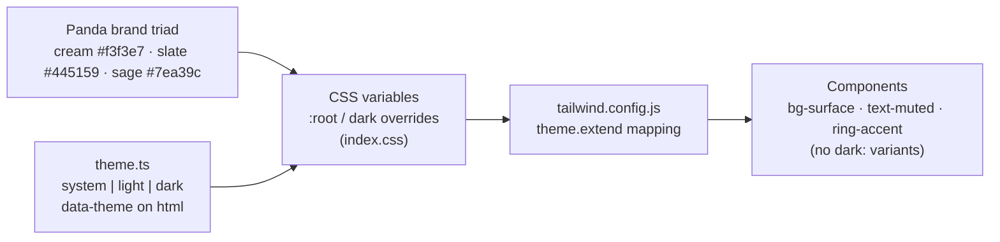
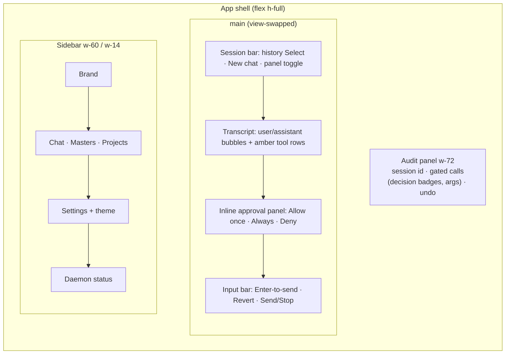

# 10 — UI Design

This document is the **pixel-level companion** to [07 — UX Flows](./07-ux-flows.md): where 07 describes
screen structure and interaction wireframe-style, this doc records the **visual design system as
implemented** in the desktop app (`ui/desktop/`), the interaction principles the screens share, an honest
comparison with two outstanding agentic products — **Manus** and **Claude Cowork** — and a prioritized set
of **enhancement designs** derived from that comparison. The implementation source of truth is
`ui/desktop/src/index.css` (tokens), `ui/desktop/src/lib/theme.ts` (theming), and
`ui/desktop/src/components/ui/*` (primitives).

## 1. Design principles

The visual language serves the product positioning ([00 — Overview](./00-overview.md)): a **calm,
local-first desk companion** for personal study and work — not a SaaS dashboard, not a developer console.

1. **Warm, quiet canvas.** A cream-paper light theme and a deep-slate dark theme, both derived from the
   "Panda" logo triad. Color is reserved for meaning (accent, tool activity, success, danger); the chrome
   stays neutral so the user's content and the agent's work carry the visual weight.
2. **Transparency is a UI feature.** The permission gate ([06 — Security & Privacy](./06-security-privacy.md))
   is not buried in settings — tool calls render inline in the transcript, approvals interrupt in place,
   and the audit trail sits one panel away. What the agent does must always be visible where it happens.
3. **Revert over confirm.** Consequential file actions are gated *before* they run and reversible *after*
   (revision/undo, FR-8); destructive UI actions act immediately rather than stacking confirmation modals.
   The design bets on recoverability, not friction.
4. **Semantic tokens, no hardcoded color.** Every component styles itself through CSS-variable-backed
   Tailwind utilities. Theming is a variable swap — there is deliberately **no `dark:` variant anywhere**
   in the component tree.
5. **Dependency-light primitives.** A small set of hand-rolled primitives (Button, Card, Badge, …) instead
   of a component-library dependency; `lucide-react` is the only visual dependency beyond Tailwind.
6. **Single-user desktop density.** No multi-tenant chrome (avatars, presence, sharing). Layouts are
   content-first, keyboard-friendly (Enter-to-send everywhere), and sized for a desktop window.

## 2. Color system

All color flows through CSS variables declared on `:root` in `ui/desktop/src/index.css`;
`tailwind.config.js` maps each variable into the Tailwind theme, so components write `bg-surface`,
`text-muted`, `border-border-strong` and recolor automatically when the theme changes.

### 2.1 Light palette (warm cream)

| Token | Value | Role |
|---|---|---|
| `--color-bg` | `#faf9f1` | App canvas |
| `--color-surface` | `#f3f1e6` | Sidebar, sunken panels (the logo cream) |
| `--color-surface-2` | `#eae6d6` | Cards, hover wells |
| `--color-border` / `-strong` | `#e5e1d0` / `#d6d1bb` | Hairlines / inputs, weightier dividers |
| `--color-text` / `-muted` / `-faint` | `#313c42` / `#5f6c72` / `#8c959a` | Body / secondary labels / timestamps & slugs |
| `--color-accent` (+`-hover`/`-fg`/`-subtle`) | `#445159` / `#353f46` / `#f6f5ec` / `#e6ece9` | Primary actions, active nav (brand slate) |
| `--color-brand` / `--color-brand-sage` | `#445159` / `#7ea39c` | Wordmark, decorative flourishes |
| `--color-tool-bg` / `-fg` / `-border` | `#f4efdf` / `#8a6d2f` / `#e6dcbf` | Tool-call rows & badges (earthy amber) |
| `--color-success` (+`-hover`) | `#4f7d5e` / `#426a4f` | Positive state, daemon-healthy dot |
| `--color-danger` (+`-hover`/`-bg`/`-fg`) | `#b5524a` / `#9d453e` / `#f6e9e6` / `#9d453e` | Destructive actions, errors |

### 2.2 Dark palette (deep slate)

The accent **shifts from slate to sage** (`#8fb3ad`) — brand slate would vanish against the slate-dark
canvas.

| Token | Value | Role |
|---|---|---|
| `--color-bg` | `#1a2125` | App canvas |
| `--color-surface` / `-2` | `#212a2f` / `#2a343a` | Panels / cards |
| `--color-border` / `-strong` | `#313c42` / `#3d4951` | Hairlines / inputs |
| `--color-text` / `-muted` / `-faint` | `#eceadd` / `#9aa6a8` / `#6c777c` | Body / secondary / tertiary |
| `--color-accent` (+`-hover`/`-fg`/`-subtle`) | `#8fb3ad` / `#a6c6c1` / `#1a2125` / `#28383a` | Sage accent |
| `--color-brand` / `-sage` | `#8fb3ad` / `#8fb3ad` | Both collapse to sage |
| `--color-tool-bg` / `-fg` / `-border` | `#2b2a1d` / `#d6bd84` / `#3b3826` | Tool amber, dark-tuned |
| `--color-success` (+`-hover`) | `#5fae7d` / `#6fbf8c` | Positive state |
| `--color-danger` (+`-hover`/`-bg`/`-fg`) | `#d97c70` / `#e2978d` / `#2e1e1c` / `#e2978d` | Destructive/errors |

### 2.3 Theming mechanics

`ui/desktop/src/lib/theme.ts` implements a three-state theme — `system | light | dark` — cycled from the
Sidebar toggle and persisted to `localStorage` (`getmasters-theme`):

- **system** removes the `data-theme` attribute from `<html>` so the
  `@media (prefers-color-scheme: dark)` block decides;
- **light**/**dark** pin `data-theme`, and the media block gates on `:not([data-theme="light"])` so a
  pinned light beats an OS-dark preference.
- `initTheme()` runs in `main.tsx` **before** the first React render — no flash of the wrong palette.
- `color-scheme` is set per theme so native controls (scrollbars, checkboxes, pickers) follow.

> **Known fragility:** the dark palette is declared **twice** — once under the media query and once under
> `:root[data-theme="dark"]` — and kept in sync by hand (the file says so in a comment). See enhancement
> **E-7** in §9.

## 3. Typography, iconography & shape

- **Typeface:** a single family token, `--font-sans: "Inter var", Inter, ui-sans-serif, system-ui, …`.
  **Inter is referenced but not bundled** — there is no `@font-face` and no font `<link>`, so users
  without Inter installed silently get the system UI font. There is **no monospace token**, even though
  tool rows and session ids render `font-mono` (falling back to the browser default).
- **Scale:** no formal type scale; sizes are ad-hoc stock Tailwind (`text-xs` badges/inputs, `text-sm`
  body/buttons, `text-base`, `text-2xl` wordmark). Weights: `font-medium` (buttons, badges),
  `font-semibold` (wordmark, headings).
- **Iconography:** `lucide-react` throughout (nav, status, tool wrench, approval shield, theme icons),
  usually `size-4`/`size-5`. Brand marks: `PandaMark` (the logo, a single cream-and-slate SVG legible on
  both themes) and `Wordmark` (mark + "Masters", `tracking-tight`).
- **Shape:** three radii — `--radius-sm: 7px` (interactive controls), `--radius: 10px` (cards),
  `--radius-lg: 14px` (feature surfaces) — echoing the rounded logo. Two soft, warm-tinted shadows
  (`--shadow-sm`, `--shadow`); dark theme swaps them for deeper black shadows.
- **Focus & motion:** every interactive primitive shares `focus-visible:ring-2 ring-accent` and
  `transition-colors`; the sidebar animates width (`transition-[width] duration-150`). There are no
  motion tokens and no `prefers-reduced-motion` handling yet.

## 4. Layout system

The shell is a plain flex row — a collapsible `Sidebar` (`w-60` expanded / `w-14` icon rail) beside a
`<main>` that swaps whole views on a single piece of state (`chat | masters | projects | settings`);
there is deliberately **no router library**. The sidebar stacks brand → primary nav → spacer →
Settings + theme toggle → a daemon-status footer (pulsing dot + `provider · vX`).

Recurring **screen archetypes**, all composed from the shared primitives:

| Archetype | Screens | Shape |
|---|---|---|
| **Chat** | `Chat.tsx`, `GroupChat.tsx` | Session bar → scrollable transcript → approval panel → input; optional right audit rail. Group chat adds author labels, round dividers, `→ tool` / `← result` lines, an `@mention` chip roster and a rounds cap Select |
| **List + create grid** | `Projects.tsx` | Centered column, inline create input, responsive `sm:grid-cols-2` card grid, icon empty state |
| **Tabbed detail** | `ProjectDetail.tsx` | Back + title header, horizontally scrollable 10-tab bar (accent underline), per-tab panel |
| **Form + rows** | `Masters.tsx`, `Teams.tsx` | Shared editor form on top (backend switch, harness quick-picks, member checkboxes, import drop-target), entity rows below with inline run/route briefs |
| **Rail settings** | `Settings.tsx` | `w-52` category rail + searchable `SettingRow`s (label/description left, control right), inline "Saved…" status text |
| **Centered wizard** | `Onboarding.tsx` | `max-w-md` card, 2 steps, gated Continue |
| **Gallery hub** | `MastersHub.tsx` | Tabbed template/entity galleries, multi-select action bar, cloud-sync header action |

## 5. Component inventory

Primitives live in `ui/desktop/src/components/ui/` — Tailwind-only, composed with a tiny `cn()` joiner,
spreading native HTML props.

| Component | Variants / API | Notes |
|---|---|---|
| `Button` | `primary · secondary · ghost · danger` × `sm · md` | Accent fill / outlined / quiet / danger fill; shared focus ring + disabled opacity |
| `IconButton` | `ghost · secondary`; required `label` | `label` doubles as `aria-label` + `title` tooltip |
| `Card` | `interactive?` | `rounded` (10px) bordered panel; interactive adds hover border/surface |
| `Input` / `Textarea` / `Select` | shared `inputBase` string | `border-strong`, accent focus ring; Select overlays a lucide chevron |
| `Badge` | `neutral · accent · tool · success · warning · danger` | Status chips — audit decisions, ACP marker, key-set indicators |
| `Brand` | `PandaMark`, `Wordmark` (`sm · md · lg`) | Logo mark + wordmark |

Notable **composites** built on them: the inline **approval panel** (tool badge + summary + Allow
once / Always allow / Deny), the **audit rail** (per-entry decision badge, collapsible redacted args,
timestamps), **mention chips** and **round dividers** in group chat, the dashed **import drop-target**
(Teams bundles), and the searchable **SettingRow**.

## 6. Interaction principles

- **Feedback:** consistent `"Loading X…"` muted early-returns; button-level busy labels ("Saving…",
  "Running…", "Syncing…") with disabled state; optimistic updates (star-a-default, extension toggles)
  that reconcile on error.
- **Gating:** the approval panel is the central human-in-the-loop pattern — inline, not modal, with
  allow-once / always-allow / deny mapping straight onto the permission model of
  [06 — Security & Privacy](./06-security-privacy.md).
- **Errors:** local `text-danger` blocks with remediation hints (provider panel offers Retry);
  non-critical fetches (audit, sessions, harness detection) degrade silently.
- **Empty states:** purpose-built per screen — icon + heading + one guiding sentence ("What can Masters
  do for you?", "No masters yet — create one above or clone a template").
- **Keyboard:** Enter-to-submit on every primary input; `focus-visible` rings on all primitives;
  `aria-current` on nav. There is **no global shortcut layer** and no command palette.
- **Recoverability:** Revert/undo for agent file changes; deletes act immediately (marked `text-danger`)
  with **no confirm and currently no undo** — see E-6.
- **Known absences** (deliberate scope so far, addressed in §9): no markdown rendering in chat bubbles
  (plain `whitespace-pre-wrap`), no toast/notification system, no skeleton loading, no plan/progress
  visualization for multi-step runs, no artifact previews.

## 7. Comparison: Manus & Claude Cowork

Two products define the current state of the art for agentic UI. **Manus** popularized the split-screen
"chat + agent computer" layout — a live workspace panel where you watch the agent browse, edit and run
in real time, with an upfront task plan checked off as it executes and intermediate files surfaced as
previewable artifacts. **Claude Cowork** (a top-level tab in Claude Desktop) frames sessions as *tasks
over a folder*: folder-scoped permission onboarding, a visible to-do list with per-step live progress in
a right sidebar, an artifacts pane of files read/created, task-suggestion chips in the empty state, and
background execution that survives the user walking away.

| Dimension | **Masters (today)** | Manus | Claude Cowork |
|---|---|---|---|
| Layout | Sidebar + single main view + optional audit rail | Chat left + "Manus's Computer" workspace right | Chat + right progress/artifacts sidebar |
| Agent-activity visibility | Inline amber tool rows + audit trail (decision, redacted args) | Live workspace replay of every action | Per-step progress list, files touched |
| Plan / progress | None (stream + tool rows only) | Upfront plan, steps checked off live | Visual to-do list updated in real time |
| Artifacts / files | Paths in tool summaries only | Previewable artifacts; editable Design View canvas | Artifacts pane with clickable previews |
| Permissions | **Strong:** inline allow-once/always/deny + folder grants + audit log | Coarse (cloud VM sandbox) | Folder-scoped grant, Always Allow, destructive-action pause |
| Sessions / organization | Session Select per view; Projects as context containers | Task list + Projects grouping | Task-oriented sessions in a folder |
| Empty-state onboarding | Welcome line + setup wizard | Template/task gallery | Task-suggestion chips over the granted folder |
| Rich text in chat | Plain text | Full markdown + rich artifacts | Full markdown + artifacts |
| Theming | System/light/dark, token-driven, warm identity | Dark minimalist | Claude house style |
| Runs | Local, foreground stream (scheduler for routines) | Cloud VM, async | Local VM, background/async, mobile monitoring |

**What Masters already does at par or better:** the permission/audit UX (inline gate + always-allow +
per-session audit trail) is genuinely ahead of Manus and on par with Cowork — it is the product's trust
signature. The token-driven dual theme and warm identity are distinctive against both.

**Where the gap is real:** everything about *watching the agent work* — plan visibility, step progress,
artifact previews, rich rendering of the agent's answers. Both competitors treat the agent's working
process as the primary content of the screen; Masters still renders it as terse tool rows and plain text.

## 8. Gap analysis → enhancement designs

Priorities are tied to the positioning: for a local-first study/work companion, **the agent conversation
is the product**, so legibility and process-transparency enhancements come first. These are design
proposals — none are implemented by this document.

### P1 — core legibility & trust

- **E-1 Markdown rendering in chat.** The single largest gap: assistant bubbles are
  `whitespace-pre-wrap` plain text, yet study workflows produce structured answers (headings, lists,
  tables, citations `[1][2]`, code). Render assistant/master bubbles with a GFM markdown renderer styled
  entirely from the tokens (§2), including a code style that needs **E-4**'s mono token. User bubbles
  stay plain.
- **E-2 Plan / progress visualization.** Cowork-style to-do affordance for multi-step runs: when a turn
  fans out into tool iterations, show a compact step list (pending → running → done/failed) above the
  transcript, driven by the existing session **event log** (`GET /sessions/{id}/events`). No new agent
  capability required — it is a projection of events the daemon already records.
- **E-3 Agent Workspace panel.** Evolve the `w-72` audit rail into a tabbed right panel — **Activity**
  (today's audit trail) · **Plan** (E-2's steps) · **Files** (artifacts the session touched, with
  preview and revert-diff per revision). This is the local-first, right-sized analogue of Manus's
  Computer: not a VM screencast, but a truthful projection of the gate, the event log, and the revision
  store the daemon already keeps.
- **E-4 Typography foundation.** Bundle Inter (`@font-face`, self-hosted — a local-first app must not
  depend on an installed font), add `--font-mono` (e.g. JetBrains Mono fallback stack) for tool rows /
  code / session ids, and define a small formal scale (`--text-xs/sm/base/lg/xl` + line heights) to
  replace ad-hoc sizing.

### P2 — polish & safety

- **E-5 Toast system.** A token-styled, `aria-live` toast layer for transient outcomes (saved, run
  finished, background routine completed) — also the substrate for E-6.
- **E-6 Undo-toast for deletes.** Keep revert-over-confirm (§1): deletes still act immediately, but show
  an "Undo" toast (5–10 s) instead of adding confirmation modals.
- **E-7 Dark-palette deduplication.** Resolve "system" in `initTheme()` (query `matchMedia` and stamp
  `data-theme` explicitly, tracking OS changes) so `:root[data-theme="dark"]` becomes the **single**
  dark block and the hand-synced media-query copy is deleted.
- **E-8 Command palette + shortcuts.** `Cmd/Ctrl+K` palette (switch view, open project, new chat, toggle
  theme, run recipe) plus a small global shortcut layer — keyboard-first is already a stated a11y goal in
  [07 §10](./07-ux-flows.md).
- **E-9 Artifact / file preview.** Clickable previews (markdown, text, images; diff view for revisions)
  inside E-3's Files tab.
- **E-10 Skeleton loading.** Replace `"Loading…"` text with token-styled skeleton blocks on list/detail
  screens.

### P3 — refinement

- **E-11 Motion tokens** (`--duration-*`, `--ease-*`) + `prefers-reduced-motion` support.
- **E-12 Spacing/density tokens** to formalize the current ad-hoc paddings.
- **E-13 Accessibility pass.** Contrast-audit the cream palette — `--color-text-faint` `#8c959a` on
  `#faf9f1` is ~2.9:1, **below WCAG AA** for the small text it is used on; add `aria-live` to the
  streaming transcript.
- **E-14 Session auto-naming** (first-message summary) so the session Select reads meaningfully.
- **E-15 Task-suggestion chips** in the chat empty state, seeded from the project's grants/knowledge
  (Cowork's onboarding pattern, localized to study/work verbs).

## 9. Cross-references

- [00 — Overview](./00-overview.md) — positioning the visual language serves.
- [01 — Product requirements](./01-product-requirements.md) — FR-8 (revert), FR-21 (approval prompts),
  NFR-9 (least privilege) shape §1/§6.
- [06 — Security & Privacy](./06-security-privacy.md) — the permission model the approval/audit UI renders.
- [07 — UX Flows](./07-ux-flows.md) — wireframe-level structure; this doc is its pixel-level counterpart.
- ADRs [0002](./adr/0002-desktop-shell.md) (Tauri shell) and [0012](./adr/0012-multi-master-conversation.md)
  (group-chat model the GroupChat UI renders).
- `CLAUDE.md` — implementation state of the Desktop UI layer.
