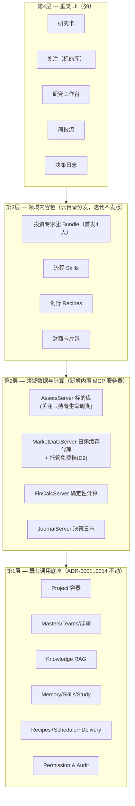

# 11 — 投资理财垂类 Agent 产品定位与设计（Masters for Investing · v3）

> 状态：**产品定位与设计文档（v3；尚未进入实施）**。
> v2 以「组合体检报告」为获客切入；v3 依据冷启动的关键洞察将其**取消**——新用户不会在
> D0 交出持仓，他们从「XX 股票怎么样」「最近什么投资火」开始试探。v3 的入口改为
> **问股即答 + 静默关注追踪**，数据（关注→持有→画像）全部**渐进累积**。
> 设计原则不变：不推翻任何既有 ADR（0001–0014）；垂类化 = 通用底座之上叠加领域数据层、
> 确定性计算层、领域内容包与垂类 UI。
> 术语对照：Master=专家、Master Team=专家团、Recipe=例行任务、Skill=技能。

---

## 0. 定位决议（已拍板，后续设计以此为前提）

| # | 决议 | 内容 |
|---|---|---|
| D1 | **市场** | 中文市场优先（基金 + A股 + 存款理财）；数据层 schema 市场无关，留海外余地 |
| D2 | **产品身份** | **整体转型**：Masters 就是投资理财 agent；品牌、onboarding、默认体验围绕投资重做 |
| D3 | **核心用户** | **有仓位的自主投资者**；入门者与重度研究者为次级画像 |
| D4 | **获客切入（v3 修订）** | **问股即答 + 自动关注追踪**（两段式 aha，§3）。~~组合体检报告~~ **取消**（挂起为后期解锁功能）：要求 D0 交出全部持仓 = 在建立信任之前索取最敏感数据，顺序是反的 |
| D5 | **数据获取（v3 修订）** | **渐进累积**：对话中提到的标的静默进入关注；「我买了 XX」轻提议记为持有；画像从对话中逐步构建。~~D0 画像问卷 + 口述录入持仓~~ 不再作为前置流程 |
| D6 | **节奏定位** | **慢投资**：不做盘中/实时与盯盘，日频数据；品牌人格 = 反焦虑、反盯盘、重纪律 |
| D7 | **商业模式** | 免费工具 + 订阅增值：积累护城河数据的功能永远免费，自动化与省心收费（§8） |
| D8 | **关注记录方式** | **静默自动 + 可撤销**：回答尾部轻提示「已加入关注」+ 一键移除；零摩擦，本地数据风险低 |
| D9 | **默认数据源** | **托管免费档默认开启**（masters-cloud 提供日频行情+基本面+公告的限频免费档，零配置保 D0 体验）；自配连接器可覆盖；订阅解锁更高额度 |
| D10 | **关注时点快照** | 自动记录（价格+日期+关注原因，成本极低），但假设收益（观察仓）**只在季度复盘中由教练带行为金融框架呈现**，不做日常展示（避免助长 FOMO，与反焦虑定位冲突） |

### 定位陈述

> **Masters 是一个本地优先的个人投资研究与纪律工作台：一支 AI 投研团队住在你的电脑里——
> 你随口问过的每一个标的它都记得、替你盯着；数字不出错、来源可查、持仓不上云，
> 帮你看清标的、读完材料、守住纪律。**

三条价值观（合规 × 形态 × 理念拧成一根绳）：**因为不荐股，所以不盯盘；因为不盯盘，
所以是慢投资；因为在本地，所以敢放数据。**

---

## 1. 与通用 Agent 的核心区别

| 维度 | 通用 Agent | 投资垂类 Agent | 映射底座 |
|---|---|---|---|
| **数据** | 本地自由文档 | 行情/财报等时序外部数据 + 关注/持仓等**渐进累积的个人结构化数据**；每个数据点带来源与时间戳 | 内置 MCP 服务器 + 4d 连接器 |
| **计算** | LLM 推理为主 | **LLM 不许心算钱**：指标全部确定性计算，LLM 只解读；归因也工具化 | rmcp 纯函数工具（同 `study::sm2` 先例） |
| **记忆与主动性** | 答完就忘、被动等问 | **问过的标的自动追踪**，出财报/大波动主动来找你——记忆 + 主动是 chatbot 结构性没有的 | watchlist + Scheduler + Delivery |
| **制衡与合规** | 无 | 风控独立视角、画像前置约束、三层合规话术、全程审计 | Master 团队 + Memory + 审计 |

**护城河的四条防御**（全部指向「让用户数据进来」）：①私有数据渐进沉淀（关注→持有→
日志，switching cost）；②数字可信（确定性计算+引用链）；③本地隐私（「你的持仓不会成为
别人的训练数据」）；④主动性（追踪触达——chatbot 答完就忘，我们记得并跟进）。

一句话：**通用 Agent 卖「能做事」，投资垂类 Agent 卖「数字可靠、来源可查、风险有人盯、
纪律帮你守——而且它记得你关心过什么」。**

---

## 2. 用户与冷启动的现实

### 核心画像 —「有仓位的自主投资者」

> “股票基金分散在支付宝、券商 App 和银行里。财报季看不过来，买卖全凭感觉，从不复盘。”

### 冷启动洞察（v3 的出发点）

**新用户不会马上提供投资内容。**真实行为序列是：先试探（「XX 股票怎么样」「最近什么
比较火」）→ 觉得有用 → 逐步透露自己（「我买了 XX」「我亏过 XX」）→ 才可能交出完整持仓。
产品的信任获取必须匹配这个序列：**入口零索取，数据渐进累积**。任何前置问卷/前置录入
都是顺序错误。

### 六个问题按新序列重排

| 阶段 | 问题 | 解法 |
|---|---|---|
| 试探期 | 看不懂（这只票/基怎么样） | 问股即答研究卡（§3.1） |
| 试探期→关注期 | 看不完（信息过载） | 自动关注追踪 + 主动触达（§3.2）+ 关注周报 |
| 透露期 | 看不全（持仓分散） | 标的生命周期渐进成账本（§3.3） |
| 沉淀期 | 算不准 | 组合级确定性计算（持仓长成后解锁） |
| 沉淀期 | 管不住 / 忘得快 | 决策日志 + 季度复盘（含观察仓归因，D10） |

获客靠**问股即答**，钩人靠**「它还记得我问过」**，留存靠**关注简报 + 渐进账本**，
复利靠**日志 + 复盘**。

---

## 3. 旗舰体验：问股即答 + 关注追踪（两段式 aha）

### 3.1 第一触点：研究卡（合规的产品化）

「XX 怎么样」恰是荐股高危区的原生问题——回答的**固定结构本身就是合规设计**：
只有事实、数据、风险与框架，永不出现评级、点位与结论。

```
┌─ XX基金 / XX股票 · 研究卡 ─── 数据截至 2026-07-15 ─┐
│ ① 是什么     一句话业务/跟踪标的 + 关键事实         │
│ ② 数据快照   估值分位 · 规模 · 费率 · 近1/3年表现    │
│              （全部来自数据源，等宽右对齐，可展开来源）│
│ ③ 值得注意   经理更换/规模膨胀/风格漂移/行业集中     │
│              （事实陈述，结论用户自己得出）           │
│ ④ 风险点     风控官署名：波动水平 · 回撤历史 · 流动性 │
│ ⑤ 近期事件   公告/财报/新闻摘要，逐条带引用          │
│ ⑥ 追问入口   「对比同类」「读它的年报」「适合我吗→    │
│              (转画像框架，画像不足时教练借机补问)」   │
├────────────────────────────────────────────────┤
│ ✓ 已加入你的关注，出财报或异动我会提醒你 [移除]      │← D8 静默+可撤销
│ ⓘ 以上为事实与风险梳理，不构成投资建议               │
└────────────────────────────────────────────────┘
```

「最近什么投资火」→ **热度事实榜**（成交/涨跌/新闻热度的客观数据）+ 教练的
「热 ≠ 好」教育视角——把最危险的问题变成行为金融的教育机会。

### 3.2 第二触点：「它还记得我问过」（真正的差异化时刻）

第一触点 chatbot 能答七八成；**第二触点是 chatbot 结构性做不到的**：

- 回答完，标的静默进入关注（D8），并**自动记录时点快照**：价格 + 日期 + 关注原因
  （从对话中提取，如「用户在比较新能源基金」）（D10）。
- 数日后主动触达（Scheduler 驱动，通知/邮件）：
  「你上周问过的 XX 今天出中报了，我读完了，三点值得注意……」
  「你关注的 XX 今天 -6%，主因是……（归因来自工具计算）」
- 触达节律受慢投资定位约束：**日频、聚合、可静默**——财报哨兵、异动阈值（超阈值才说话）、
  每周关注周报；绝不做盘中推送。

### 3.3 标的生命周期：一条数据主线取代「自选 vs 账本」二元结构

```
问过 ──静默──▶ 关注（快照+原因）──"我买了XX"轻提议──▶ 持有（成本/数量）──▶ 卖出 ──▶ 复盘
```

- **自选列表和持仓账本是同一个「标的库」的不同状态**，不是两个功能。
- 持有状态由对话渐进累积：用户提到「我买了/我持有/我亏了」，教练轻提议「记下来？」
  （一句话即算记录，Write 审批垂类化呈现）。永不主动索取全量持仓。
- 画像同理渐进：从用户问的标的类型、表露的风险态度中逐步写入 `RISK_PROFILE.md`
  （文件为真，用户可改），教练在自然时机补问（如研究卡的「适合我吗」追问）。
- 持仓长成后，组合级能力**自动解锁**（集中度提醒、组合归因、配置视角）；
  ~~体检报告~~ 挂起至此阶段再议——那时它是**对老用户的深度功能**，不是对新用户的门槛。

### 3.4 观察仓（D10，复盘专用）

关注时点快照使「你 3 月问过的 XX 至今 +12%，而你买的 YY -3%」成为可能——这是行为
金融上的双刃剑（可能助长 FOMO/懊悔）。约束：**只在季度复盘中由教练带框架呈现**
（「关注但未买」的机会成本是决策质量数据，不是催单信号），日常界面绝不展示。

---

## 4. 用户旅程 D0 → D90

| 阶段 | 体验 | 设计意图 |
|---|---|---|
| **D0** | 下载 → 直接问「XX 怎么样」→ 研究卡（数据开箱可用，D9）→ 尾部「已加入关注」 | **入口零索取**；aha 第一段在首次提问内完成 |
| **D2–7** | 第一次主动触达：「你问过的 XX 出财报了/异动了」→ 用户回来追问 | aha 第二段：「它还记得」——差异化确立 |
| **D8–30** | 关注长到 5–10 个 → 每周关注周报开始有内容；对话中提到「我买了」→ 轻提议记为持有（账本种子） | 渐进累积启动；周报成为回访习惯 |
| **D30–60** | 持有状态积累 → 组合级视角解锁（「你持有的三只基金同赛道，集中度偏高」）；真实交易发生 → 日志植入（一句话即记） | 从「标的研究」升维到「组合视角」 |
| **D90** | 首季复盘：决策归因 + 观察仓对照（教练带框架）+ 纪律执行率 | 画像+关注+持有+日志已无法迁移，护城河成型 |

v2 的「D8–30 死亡谷」在 v3 被结构性缓解：第二触点（追踪触达）天然填充体检后的空窗——
**主动性本身就是留存机制**。剩余风险：关注列表为空的用户（问了一次就走）——靠热度榜
与「本周市场值得注意的三件事」默认简报兜底。

---

## 5. 模块架构：「底座不动，四层叠加」



### 模块清单（v3 修订）

- **M1 标的库 `AssetsServer`**（v2 的 PortfolioServer 重构为生命周期模型）：
  `assets`（标的 + 状态：watching/holding/sold + 关注快照：时点价格/日期/原因）、
  `positions`（持有明细：成本/数量/账户，渐进累积）、`txns`、`accounts`。
  工具：`track_asset`（对话流静默调用，Write 但归类为低敏——本地、可撤销）、
  `untrack`、`record_position`/`record_txn`（轻提议 + 审批）、`list_assets`（Read）。
  明细永不出设备；云端上下文可选脱敏。
- **M2 市场数据 `MarketDataServer`**（**升为 MVP 核心**，D9）：日频行情 + 基本面快照 +
  估值分位 + 公告/财报日历 + 新闻/热度，统一 schema + 「数据截至」戳 + 本地缓存 + 限频。
  **默认后端 = masters-cloud 托管免费档**（零配置保 D0）；自配 4d 连接器（AKShare/
  Tushare 等）可覆盖或补充；订阅解锁更高频/更全字段。明确不做盘中/实时。
- **M3 金融计算 `FinCalcServer`**（后移至持仓长成阶段）：收益（TWR/XIRR）、风险（波动/
  回撤/夏普）、结构（集中度 HHI/配置/再平衡偏离）、**费率侵蚀**、假设检验。
  MVP 期研究卡的数字直接来自数据源（分位/表现为数据商字段），组合级计算 V1 进入。
  纪律不变：凡数字必出自工具；**归因也工具化**。
- **M4 研究知识库**：零新代码复用 Knowledge/RAG（年报/研报 ingest → 页码引用）；
  研究卡的「近期事件」逐条带引用。
- **M5 投资者画像**：`RISK_PROFILE.md`，**渐进构建**（对话推断 + 教练自然时机补问 +
  用户可改），不再有前置问卷。
- **M6 投资专家团**（§6）。
- **M7 流程 Skills**：建仓前检查清单、基金尽调清单、复盘模板；agent 可自我沉淀。
- **M8 例行 Recipes**：**财报哨兵 + 异动阈值提醒 + 每周关注周报**（v3 的 MVP 三件套，
  第二触点的引擎）→ 月度组合视角、季度复盘。headless 路径 + 审计，邮件默认关（ADR-0009）。
- **M9 决策日志 `JournalServer`**：论点/反论点/失效条件/情绪 + 关联会话；一句话即记；
  季度复盘含观察仓归因（D10）。
- **M10 投资学习**：复用 Study；卡片包云目录分发；次级画像承接。

---

## 6. 投资专家团（v3 · 首发名单随入口场景重排）

入口是个股/基金问答而非组合配置——**研究员进 MVP，配置规划师后移**（持仓未长成时
无用武之地）：

### 首发 4 人（MVP）

| 专家 | 职责 | 最小权限工具 | 档位 |
|---|---|---|---|
| **首席顾问 @chief**（协调者） | 主持研究卡产出、汇总观点、出投资备忘录 | MarketData/Assets/Knowledge 读 | 旗舰 |
| **研究员 @analyst** | 个股+基金研究（业务事实、估值分位、经理任期、规模、费率、风格漂移）——研究卡主笔 | MarketData/Knowledge | 旗舰 |
| **风控官 @risk** | 研究卡「风险点」栏、异动归因把关、画像匹配检查、**唱反调**（异议独立呈现） | MarketData/Assets/FinCalc | 旗舰（可固定**本地模型**：持有明细不出设备，ADR-0013 红利） |
| **投资教练 @coach** | 「热≠好」教育、画像渐进补问、日志与复盘主持（含观察仓框架）、学习计划 | Study/Memory/Journal/Assets | 中档 |

### P1 扩编

**配置规划师 @allocation**（持仓长成后进——组合级解锁的主角）、**基金研究员/个股研究员
拆分**（@analyst 一拆二）、**费率侦探 @fee**（费用侵蚀专项，替代 v1 税务顾问）、
**宏观分析师 @macro**（降权：只出「宏观对配置的含义」一段话）。

机制全部现成：@提及（CJK）、无提及→首席、多轮互评（研究卡产出 = @analyst 主笔 →
@risk 质询一轮，4f）、逐专家流式 + 工具可见性（4e/4g）、每专家独立模型（ADR-0013）。

---

## 7. 信任与合规：三层话术体系

**产品原则排序：「永不给错数」高于「分析深刻」**；宁可显式降级也不模糊作答。
v3 下合规敏感度**升级**：入口问题（「XX 怎么样」「什么火」）恰是荐股高危区的原生形态，
研究卡与热度榜的固定结构就是合规的产品化。

1. **声明层**：首启确认 + 每份产出尾注 + 固定 UI 元素。
2. **边界层**（写进 persona）：可以说——事实、数据、费用、风险、与用户自己画像的匹配、
   框架、知识（「经理三年换两次、规模膨胀 5 倍、费率同类前 10%」全是事实陈述）；
   不可以说——买/卖/换指令、目标价、点位、评级、收益预期、「我看好」。
3. **兜底层**：索要结论时的标准转化——「我不能给买卖指令，但可以：①对照你的画像评估
   ②让 @risk 出风险梳理 ③给你一份研究框架」。

**红线**：不是投顾、不执行交易（不接任何下单通道；标的库是记录不是通道）、隐私分层
（本地模型专家 + 脱敏模式 + 全程审计）。

---

## 8. 商业模式：免费工具 + 订阅增值（D7/D9）

**切分原则：积累护城河数据的功能永远免费；「自动化与省心」收费。**
D9 使托管数据源成为免费档的一部分（保 D0 体验），订阅的价值主张相应调整：

| | 免费（BYOK 模型 key） | 订阅 |
|---|---|---|
| 问股即答研究卡 | ✅（托管数据免费档，限频） | 更高数据额度/更全字段 |
| 关注追踪 + 快照 | ✅ 永久免费 | |
| 标的库/持有记录/决策日志 | ✅ 永久免费 | |
| 主动触达 | ✅ 基础（财报哨兵 + 周报） | ✅ 完整例行族（异动阈值/月度组合视角/自定义） |
| 专家团 | ✅ 首发 4 人 | 扩编专家 + 多轮互评 |
| 复盘 | 手动 | ✅ 季度自动归因复盘（含观察仓） |
| 内容包 | 基础 | ✅ 云目录高阶包 |

托管免费档的成本核算（缓存命中率/限频/字段裁剪）是商业化前的关键作业（§13）。

---

## 9. 产品 UI 设计

### 9.1 设计原则（承接 docs/10，垂类扩展）

1. **信任前置**：时效戳、来源角标、「计算依据」展开、审计面板。
2. **数字排版尊严**：等宽（tabular-nums）、右对齐、统一精度。
3. **语义涨跌色**：`--color-gain`/`--color-loss`（跌不是「错误」）；中文默认红涨绿跌，
   可切换；色弱模式 ▲▼ 冗余编码。
4. **克制的图表**：极轻 SVG，不引入重型图表框架。
5. **慢投资视觉气质**：留白、低饱和、无闪烁数字；免责声明是设计元素。

### 9.2 信息架构（v3：对话即落地页，关注是核心资产页）

```
💬 对话         ← 落地页：问股即答（含研究卡渲染、审计右栏）
⭐ 关注         ← 核心页：标的库卡片流（状态徽章 问过/关注/持有 · 关注原因 ·
                  近期事件 · 追踪开关）——「自选与持仓是同一列表的不同状态」
📰 简报         ← 触达产出流（财报哨兵/异动/周报，未读态，可「就此提问」）
🔬 研究         ← 专家团群聊 + 右侧证据面板（引用原文 + 数据快照并排）
📓 日志         ← 决策时间线（事后徽章、季度复盘置顶）
🎓 学习         ← Study 垂类皮肤
📊 组合         ← 持有状态长成后解锁（集中度/配置/归因；体检挂起于此）
📁 项目 / ⚙ 设置 ← 现有
```

### 9.3 核心屏幕

- **对话页（落地）**：空状态即引导——输入框上方三个示例问题（「XX 股票怎么样」
  「对比这两只基金」「最近什么值得注意」）；研究卡在消息流内整卡渲染（§3.1 结构），
  尾部「已加入关注 [移除]」轻条。
- **关注页**：每个标的一张卡——名称 + 状态徽章（关注/持有）+ 关注原因（来自对话）+
  「数据截至」+ 近期事件角标 + 追踪开关；点击进入标的详情（历史研究卡、相关对话、
  持有记录）。**不显示「自关注以来 ±%」**（D10：观察仓只进复盘）。
- **研究工作台**：三栏（专家名册含模型徽章 🏠 / 群聊流 / 证据面板——引用可点开原文段落 +
  数据快照 + 计算结果表，结论与依据并排）。
- **简报流 / 日志 / 学习**：同前版设计。
- **审批垂类化**：「记为持有：XX 基金 ¥50,000」字段预览，非原始 JSON。
- **脱敏开关 🙈**：全局顶栏，UI 与云端上下文同时生效。

---

## 10. 功能需求清单（FR-INV-*，v3 重排）

| ID | 需求 | 优先级 |
|---|---|---|
| FR-INV-1 | **问股即答研究卡**：固定六段结构（事实/数据快照/值得注意/风险/近期事件/追问），数字全部来自数据源，逐条引用 | **P0 (MVP)** |
| FR-INV-2 | **静默关注 + 可撤销**：对话中的标的自动入关注，时点快照（价格/日期/原因），尾部轻提示 + 一键移除 | **P0 (MVP)** |
| FR-INV-3 | **托管免费数据源**（日频行情/基本面/公告，限频）默认开启；4d 连接器可覆盖；优雅降级 | **P0 (MVP)** |
| FR-INV-4 | **主动触达三件套**：财报哨兵 + 异动阈值提醒 + 每周关注周报（通知/邮件，日频聚合可静默） | **P0 (MVP)** |
| FR-INV-5 | 首发 4 人专家团 Bundle（首席/研究员/风控/教练）+ @提及群聊 + 研究卡的 analyst→risk 质询轮 | **P0 (MVP)** |
| FR-INV-6 | 三层合规话术体系（声明/边界/兜底）+ 热度事实榜（「热≠好」） | **P0 (MVP)** |
| FR-INV-7 | 关注页（标的库卡片流 + 状态徽章 + 详情页） | **P0 (MVP)** |
| FR-INV-8 | 研报/年报 RAG 问答带页码引用（复用） | P0（零代码） |
| FR-INV-9 | **渐进持有记录**：「我买了 XX」→ 轻提议记录（一句话即记，审批垂类化）；画像渐进构建 `RISK_PROFILE.md` | P1 |
| FR-INV-10 | 组合级解锁：FinCalc（集中度/配置/归因/费率侵蚀）+ 组合页 + 配置规划师进团 | P1 |
| FR-INV-11 | 决策日志（一句话即记）+ 季度归因复盘（含观察仓对照，教练带行为金融框架） | P1 |
| FR-INV-12 | 脱敏模式（UI + 云端上下文双生效）；风控官可固定本地模型 | P1 |
| FR-INV-13 | 专家团扩编（基金/个股拆分、费率侦探、宏观）+ 订阅位（例行族/高额度数据/复盘） | P1 |
| FR-INV-14 | 截图识别录入（前置：Provider 视觉能力）+ CSV 导入——服务已愿意批量交数据的用户 | P2 |
| FR-INV-15 | 投资学习（卡片包 + 个性化生成 + SM-2）（复用） | P2 |
| FR-INV-16 | 涨跌配色切换；组合体检报告（挂起复活评估）；导出/模拟组合/目标规划 | P2 |

**非功能**：NFR-INV-1 指标数值零 LLM 生成；NFR-INV-2 外部数据点必带来源与时间戳；
NFR-INV-3 持有明细默认不出设备；NFR-INV-4 标的库/日志写入可审批、可审计、可回滚；
NFR-INV-5 主动触达日频聚合、可静默、绝不盘中推送。

---

## 11. 实施路线（v3）

| 阶段 | 内容 | 备注 |
|---|---|---|
| **MVP（问答+追踪闭环）** | `MarketDataServer` + 托管免费档（cloud 侧 API）+ `AssetsServer`（watching 状态 + 快照）+ 研究卡（渲染 + persona 合同）+ 静默关注 + 触达三件套（Recipes）+ 4 人团内容包 + 关注页 + 合规三层 | aha 两段完整交付；cloud 数据服务是新增基建 |
| **V1（渐进沉淀）** | 持有状态 + 渐进记录 + 画像渐进构建 + `FinCalcServer` + 组合页解锁 + 配置规划师 + 订阅位（例行族/数据额度） | 商业化起点 |
| **V2（纪律闭环）** | `JournalServer` + 日志时间线 + 季度复盘（观察仓归因）+ 脱敏模式 + 专家扩编 | 护城河深化 |
| **V3（扩展）** | 截图识别（Provider 视觉）/CSV、学习内容包、体检复活评估、导出/模拟/目标规划 | 次级画像与深度功能 |

---

## 12. 竞争定位一页纸

| 竞品 | 他们是什么 | 我们的差异 |
|---|---|---|
| 通用 chatbot（豆包/ChatGPT） | 什么都能聊 | **答完就忘**；我们记得你问过什么并替你盯着；数字确定性计算；本地隐私 |
| 有知有行 | 投资理念内容 | 理念同频，但没有 agent、没有你的数据闭环 |
| 支小宝/蚂蚁财富 AI | 平台导购型助手 | 平台助手为销售服务；我们本地、中立、不卖产品 |
| 同花顺问财类 | 荐股式问答 | 他们给结论我们给依据；他们云端我们本地 |
| Wind/Choice 个人版 | 专业数据终端 | 他们是数据，我们是「会用数据的团队」 |

**站位一句话：所有对手要么想卖你产品，要么想给你答案，要么答完就忘；Masters 站在
你这边——给你依据、记得你关心过什么、替你盯着，而且数据留在你自己的电脑上。**

---

## 13. 待决问题（下一轮）

1. **托管免费数据源的成本模型**（v3 后成为 MVP 前置）：数据上游选型与授权、缓存命中/
   限频/字段裁剪下的单用户成本、免费档与订阅档的额度线。
2. **品牌与命名**：整体转型后的中文产品名与 tagline（慢投资轴心）。
3. **关注为空用户的兜底**：默认「本周市场三件事」简报的形态与合规边界。
4. **转型重写范围**：README / docs/00/01/07/10 / masters-cloud 落地页（实施期挂账）。
5. **新增 ADR**（实施时）：`0015-vertical-domain-packs`、`0016-asset-lifecycle-storage`
  （标的生命周期 + 脱敏边界）、`0017-hosted-market-data`（托管数据免费档——cloud 首次
   成为运行时依赖的边界与降级）、`0018-provider-vision`（P2 截图识别）。
