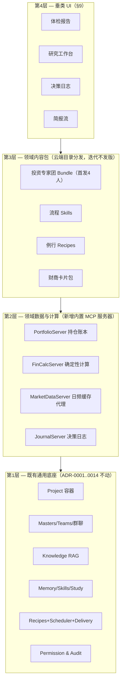

# 11 — 投资理财垂类 Agent 产品定位与设计（Masters for Investing · v2）

> 状态：**产品定位与设计文档（v2，经充分定位讨论后修订；尚未进入实施）**。
> v1 是架构骨架；v2 固化了八项定位决议，围绕「组合体检」重构了产品叙事、专家团、
> 商业模式与路线图。设计原则不变：**不推翻任何既有 ADR（0001–0014）**——垂类化 =
> 在通用底座之上叠加领域数据层、确定性计算层、领域内容包与垂类 UI。
> 术语对照：Master=专家、Master Team=专家团、Recipe=例行任务、Skill=技能、Grant=授权。

---

## 0. 定位决议（已拍板，后续设计均以此为前提）

| # | 决议 | 内容 |
|---|---|---|
| D1 | **市场** | 中文市场优先（基金 + A股 + 存款理财为核心资产形态）；数据层 schema 设计为市场无关，保留海外余地 |
| D2 | **产品身份** | **整体转型**：Masters 就是投资理财 agent。品牌、onboarding、默认体验全部围绕投资重做；通用能力退为底层 |
| D3 | **核心用户** | **有仓位的自主投资者**（有真实持仓、有真实痛点、付费意愿最强）；入门者与重度研究者为次级画像 |
| D4 | **获客切入（aha moment）** | **组合体检报告**：录入持仓 → 10 分钟出专家团联合署名的结构化体检报告 |
| D5 | **持仓录入主路径** | **口述/对话式为主（P0）**；CSV 与持仓截图识别为 P1（截图需 Provider 层视觉能力，见 §4.3） |
| D6 | **节奏定位** | **慢投资**：明确不做盘中/实时行情与盯盘场景，日频数据（净值/收盘价）为主；品牌人格 = 反焦虑、反盯盘、重纪律 |
| D7 | **商业模式** | **免费工具 + 订阅增值**：积累护城河数据的功能永远免费（BYOK），自动化与省心收费（§8） |
| D8 | **体检形态** | **静态结构化报告为主体 + 逐段可追问**：报告是名片（仪式感、可对比、可分享），追问跳入研究工作台（对话是留存） |

### 定位陈述

> **Masters 是一个本地优先的个人投资研究与纪律工作台：一支 AI 投研团队住在你的电脑里——
> 持仓不上云，数字不出错，帮你看清组合、读完材料、守住纪律。**

三条互相咬合的价值观（合规红线 × 桌面形态 × 投资理念拧成一根绳）：

- **因为不荐股，所以不盯盘**——不给买卖指令与点位，只给事实、数据、风险与框架；
- **因为不盯盘，所以是慢投资**——服务深度研究、定期体检与季度复盘，不服务盘中焦虑；
- **因为在本地，所以敢放数据**——持仓是最敏感的个人数据之一，明细永不出设备。

---

## 1. 与通用 Agent 的核心区别

通用 Agent（Cowork/Manus 类）的能力形状是「自由文本 + 文件操作 + 开放工具」。投资场景在
四个维度提出结构性不同的要求，而这四条恰好逐一映射到 Masters 已有的底座：

| 维度 | 通用 Agent | 投资垂类 Agent | 映射底座 |
|---|---|---|---|
| **数据** | 用户手头的本地文件 | 行情/财报等**时序外部数据** + 持仓/交易等**结构化账本**；每个数据点带来源与时间戳 | 内置 MCP 服务器 + 4d 连接器 |
| **计算** | LLM 推理为主 | **LLM 不许心算钱**：收益/回撤/集中度/费率全部由确定性代码计算，LLM 只做解读 | rmcp 纯函数工具（同 `study::sm2` 先例） |
| **时间性** | 一次性任务 | 财报日历、定投周期、复检节律——**调度器从附属升级为核心引擎** | Recipes + Scheduler + Delivery |
| **记忆与制衡** | 通用偏好 | **风险画像**是所有建议的前置约束；**风控独立视角**复刻真实投研制衡；**决策日志**形成复利 | Memory 文件 + Master 团队 + 审计 |

一句话：**通用 Agent 卖「能做事」，投资垂类 Agent 卖「数字可靠、来源可查、风险有人盯、
纪律帮你守」。**

### 为什么用户不直接问通用 chatbot（护城河）

「AI 聊股票」本身零护城河。真正的防御只有四条，且全部指向同一设计要求——**让用户把数据
放进来**：

1. **私有数据积累**：账本、画像、决策日志在本地沉淀，聊得越久越无法迁移（switching cost）；
2. **数字可信**：chatbot 心算组合收益会错；我们有确定性计算引擎 + 引用链；
3. **本地隐私**：「你的持仓不会成为别人的训练数据」——通用云端 chatbot 结构性做不到；
4. **主动性**：财报哨兵、月度复检、再平衡巡检由 scheduler 驱动；chatbot 永远被动等你问。

推论：**账本录入的摩擦是全产品最重要的单点**，值得投入超出直觉的资源（§4.3）。

---

## 2. 用户与痛点

### 核心画像（D3）—「有仓位的自主投资者」

> “股票基金分散在支付宝、券商 App 和银行里，没有全局视图。财报季看不过来，
> 买卖全凭感觉，从不复盘。”

**中文用户持仓现实**：支付宝/天天基金里的基金 + 券商 App 里的股票 + 银行 App 里的理财——
这些平台**几乎没有像样的导出功能**。任何以「导入 CSV」为前提的设计都会卡死冷启动（这是
v1 文档的海外思维错误，v2 已按 D5 修正为口述为主）。

### 次级画像

- **理财入门者**：学习模块（Study 复用）+ 教练专家 + 模拟组合承接；获客友好、付费弱。
- **重度研究型投资者**：研报 RAG + 跨年报对比 + 本地模型隐私边界承接；小众、粘性极强。

### 产品要解决的六个问题（按产品角色分层）

| 问题 | 解法 | 产品角色 |
|---|---|---|
| 看不全（多账户无全局） | 账本聚合 + 体检/仪表盘 | **数据地基**（必须有，非卖点） |
| 算不准（指标靠感觉） | 确定性金融计算 | 信任地基 |
| 看不完（财报研报过载） | 定向 RAG 摘要 + 简报 | 获客与日常价值 |
| 看不懂（专业门槛） | 教练 + Study 学习闭环 | 次级画像承接 |
| 管不住（情绪化、无纪律） | 决策清单 + 决策日志 + 风控专家 | **长期留存的灵魂**（逆人性，不能靠它获客） |
| 忘得快（从不复盘） | 季度归因复盘 | 复利飞轮 |

获客靠**体检**，留存靠**账本 + 简报**，复利靠**日志 + 复盘**。

---

## 3. 旗舰功能：组合体检报告（D4/D8）

体检是获客的全部赌注，其形态细节就是产品定位本身。

### 3.1 报告结构（固定模板 —— 固定才能季度对比，对比是留存钩子）

```
┌────────────────────────────────────────────────┐
│  组合体检报告 · 2026-07  总评 72/100            │
│  「结构基本健康，两处集中度风险，费率有明显优化空间」│
├────────────────────────────────────────────────┤
│ ① 配置结构      🟢  股 58 / 债 22 / 现金 20     │
│    — 配置规划师署名解读（3-5 句）               │
│ ② 集中度        🟡  前 3 大持仓占 61%，同赛道    │
│    — 风控官署名解读                             │
│ ③ 波动与回撤暴露 🟡  组合历史最大回撤 -23%       │
│    — 风控官署名解读（未接数据源时：🔒 接入后解锁）│
│ ④ 费率侵蚀      🔴  去年费用约 ¥3,400，其中      │
│    ¥1,200 可通过份额转换节省                    │
│    — 费率侦探署名解读                           │
│ ⑤ 画像匹配度    🟢  当前波动暴露与你的画像相符    │
│    — 投资教练署名解读                           │
├────────────────────────────────────────────────┤
│ ⚠ 风控官异议栏（有保留意见时单独红框呈现）        │
├────────────────────────────────────────────────┤
│ 每个数字：等宽右对齐 · 可展开「计算依据」         │
│ 每段解读：可「就此提问」→ 跳入研究工作台          │
├────────────────────────────────────────────────┤
│ 尾部唯一钩子：[ 30 天后自动复检 + 每周简报 ]      │
│ 尾注：本报告为分析工具输出，不构成投资建议        │
└────────────────────────────────────────────────┘
```

设计要点：

- **像体检报告，不像聊天记录**：五维固定结构 + 红黄绿灯 + 总评分。
- **「费率侵蚀」是独立维度**：中国公募申赎费+管理费侵蚀巨大且极少有人算过。
  「你去年付了 ¥3,400 的基金费用」——震撼力强、纯算术零幻觉、不踩合规线（陈述费用
  事实不是荐股）。**这是全产品最可能被自发传播的一句话。**
- **专家逐段署名 + 风控异议独立成栏**：体检是用户第一次见到专家团，「多人格局」和
  「制衡感」要在这份文档里立住——制衡感是信任感的来源。
- **报告尾部只钩一件事**（订阅复检），不贪多。
- **静态 + 可追问**（D8）：报告是名片，追问跳入研究工作台是留存入口。

### 3.2 体检的 MVP 简化（口述录入带来的红利）

体检首版**可以完全不依赖行情数据源**：口述录入时教练直接问「这笔现在市值多少」。
①配置结构 ②集中度 ④费率 ⑤画像匹配四个维度全部是对用户报数的算术；只有
③波动与回撤需要历史行情——首版显示 🔒「接入数据源后解锁」，反而成为配置数据源的
内生动机。**aha moment 的交付不被最重的外部依赖（行情源）卡住。**

### 3.3 录入流程（口述为主，D5）

教练主持的引导式对话，目标 **≤10 分钟完成画像 + 持仓**：

1. **画像问卷嵌在体检流程里**（不是独立步骤）：「体检前，先花 3 分钟让我了解你」——
   风险承受、期限、目标、禁忌 → 生成 `RISK_PROFILE.md`（用户可随时手改）。
2. **逐账户口述**：「支付宝里有什么？」用户口述或粘贴文本 → 右栏结构化表格**实时逐行
   长出来** → 用户确认 → 落库（Write 审批，垂类化审批卡显示为「记录持仓：XX 基金
   ¥50,000」而非原始 JSON）。每步可跳过，残缺数据也能出降级版体检。
3. **P1 增强**：持仓截图识别（支付宝/券商 App 截图 → 本地识别 → 确认落库）。
   前置条件：Provider trait 增加视觉能力（目前仅 chat/stream/embed）——**这是转型后
   第一个真正的底座扩展需求**。隐私叙事加分项：「你的持仓截图不会成为别人的训练数据」。
   CSV/对账单导入同为 P1 兜底。

---

## 4. 用户旅程 D0 → D90（留存设计）

| 阶段 | 体验 | 设计意图 |
|---|---|---|
| **D0** | 下载 → 教练 3 分钟画像 → 口述持仓 → **体检报告** → 钩「30 天复检 + 周简报」 | aha 在首次会话内完成 |
| **D1–7** | 第一期周简报送达（通知/邮件）；用户第一次主动追问 → 研究工作台，见识 @风控 @配置 多角色讨论 | 从报告读者变成对话用户 |
| **D8–30** | 第一次真实交易发生 → 教练提议「记入决策日志？论点/反论点/失效条件」 | **全旅程最关键的习惯植入点**；摩擦必须降到「说一句话就算记了」 |
| **D30** | 首次自动复检，「与上月对比」出现 | 结构化报告的复利开始显形 |
| **D90** | 首次季度决策复盘：「记了 4 笔决策，2 笔已验证，止损纪律执行率 50%」 | 画像+账本+日志已无法迁移，护城河成型 |

**已知薄弱环节**：D8–30 的「死亡谷」（体检看完、简报未成习惯、日志未开始）。候选填充
物：财报哨兵的第一次命中、由用户真实疑问触发的一次深度研究。待后续专项设计。

---

## 5. 模块架构：「底座不动，四层叠加」



### 模块清单（与 v1 一致处从简，修订处标注）

- **M1 持仓账本 `PortfolioServer`**（新内置 MCP，DB-owned，同 Study 先例）：
  `accounts`/`holdings`/`txns`/`watchlist`/`price_cache`。录入以对话式为主（D5 修订）；
  明细永不出设备，云端模型上下文可选**脱敏模式**（隐藏绝对金额只给权重）。
- **M2 金融计算 `FinCalcServer`**（无状态纯函数 + 薄 MCP 壳，全 Read）：收益（TWR/XIRR/
  年化/定投成本线）、风险（波动/最大回撤/夏普/Beta/VaR）、结构（配置/集中度 HHI/再平衡
  偏离）、**费率侵蚀**（v2 升为一等公民）、假设检验（定投模拟/目标倒推）。
  **纪律约束**：persona 中固化——凡数字必调工具并附参数；**涨跌归因也要工具化**（「跌
  1.2% 主要因为 XX 占 30% 跌了 4%」是算术，LLM 只许复述，不许编故事）。
- **M3 市场数据 `MarketDataServer`**（**日频**缓存代理，D6 修订）：基金净值 + 收盘价 +
  基本面快照 + 财报日历；统一 schema + 「数据截至」戳 + 限频；具体数据源为可插拔 4d
  连接器（AKShare/Tushare 等，中文源优先，schema 市场无关）。**未配置时优雅降级**
  （体检可跑，相关维度上锁）——行情是增强而非前置。**明确不做盘中/实时。**
- **M4 研究知识库**：零新代码复用 Knowledge/RAG（年报/研报/招募说明书 ingest → 带页码
  引用）。后续增强：按标的/报告期元数据标签、跨年报定向对比。
- **M5 投资者画像**：`RISK_PROFILE.md`（Memory 文件为真，问卷生成、用户可改、自动注入
  所有会话）。所有专家的每个建议以画像为前置约束。
- **M6 投资专家团**（§6，v2 重校准）。
- **M7 流程 Skills**：建仓前检查清单（论点/反论点/失效条件/仓位上限）、基金尽调清单、
  复盘模板；允许 agent 自我沉淀（ADR-0006）——垂类里纪律本身就是最有价值的技能。
- **M8 例行 Recipes**：周简报（MVP）→ 月度体检、财报哨兵、再平衡巡检（超阈值才提醒，
  静默通过不打扰）、季度决策复盘。全部走既有 headless 路径（grant 内 + 审计），邮件
  默认关闭（ADR-0009 不变）。
- **M9 决策日志 `JournalServer`**（垂类差异化的灵魂）：`decisions`（时间/标的/动作/
  论点/反论点/失效条件/情绪自评/关联会话 id）。写入摩擦压到「说一句话就算记了」；
  季度复盘 Recipe 用 FinCalc 做事后归因，结论沉淀进 Memory——**通用 Agent 完全没有的
  复利飞轮**。
- **M10 投资学习**：零新代码复用 Study；财商卡片包云目录分发 + 从用户自己的研报/亏损
  案例生成个性化卡片。次级画像（入门者）的主承接。

---

## 6. 投资专家团（v2 · 为「中文基金+A股用户」重校准）

v1 的七人名册是美式投研思维，v2 修正，并按 MVP 收敛为**首发 4 人**——4 个打磨过的角色
胜过 7 个平庸的：

### 首发 4 人（MVP）

| 专家 | 职责 | 最小权限工具 | 建议档位 |
|---|---|---|---|
| **首席顾问 @chief**（协调者） | 汇总观点、出体检总评与投资备忘录、主持流程 | Portfolio/FinCalc/Knowledge 读 | 旗舰 |
| **配置规划师 @allocation** | 大类资产配置（股债现金比例）——中文大众投资者的第一问题 | Portfolio/FinCalc | 旗舰 |
| **风控官 @risk** | 集中度/回撤体检、画像合规检查、**唱反调**（异议独立成栏） | Portfolio/FinCalc | 旗舰（可固定**本地模型**：持仓明细不出设备，ADR-0013 红利） |
| **投资教练 @coach** | 画像问卷、白话解释、行为纠偏、日志与复盘主持、学习计划 | Study/Memory/Journal | 中档 |

### P1 扩编

| 专家 | 说明 |
|---|---|
| **基金研究员 @fund** | 基金/ETF 尽调（经理任期、规模膨胀、风格漂移、同类费率分位）——对中文用户比个股分析更高频 |
| **费率侦探 @fee** | 费用侵蚀专项（v1 的「税务顾问」被替换：A股个人资本利得暂免，税务话题弱；费率高共鸣零合规风险）。MVP 期其职责由 FinCalc + 风控官暂代 |
| **个股研究员 @equity** | 财报解读、商业模式，逐条引用（重度研究者画像的主承接） |
| **宏观分析师 @macro** | 降权：只输出「宏观对配置的含义」一段话，不做独立研报 |

机制全部现成：@提及路由（含 CJK）、无提及→首席、多轮互评（如 @allocation 结论自动
@risk 质询一轮，4f）、按专家归属流式输出与工具可见性（4e/4g）、每专家独立模型
（ADR-0013）。输出契约：首席=投资备忘录、风控=风险体检卡、基金研究员=尽调速读表——
结构化输出使 UI 可渲染成卡片、使季度可对比。

---

## 7. 信任与合规：三层话术体系（中文市场 + 整体转型下的生存问题）

**产品原则排序：「永不给错数」的优先级高于「分析深刻」**——用户发现收益率算错一次，
就永久失去信任。宁可显式降级（「数据源未配置，无法回答」）也不模糊作答。

1. **声明层**：首启确认 + 每份产出尾注 + 固定 UI 元素（不做成可忽略的灰字）。
2. **话术边界层**（写进每个专家 persona，是产品的一部分）：
   - **可以说**：事实、数据、费用、风险暴露、与用户自己画像的匹配度、研究框架、金融知识。
     边界内大有可为——「这只基金的经理三年换了两次、规模膨胀 5 倍、费率同类前 10%」
     全是事实陈述，结论用户自己得出。
   - **不可以说**：买/卖/换的指令、目标价、点位、评级、收益预期、「我看好」。
3. **兜底层**：用户索要结论性建议时的标准转化（不冷拒）——「我不能给买卖指令，但可以：
   ①对照你的画像评估 ②让 @risk 出体检 ③给你一份研究框架」。

**红线**（不变）：不是投顾、不执行交易（不接任何下单通道——账本是记录不是通道，
ADR-0009 outbound-only 的垂类对应）、隐私分层（本地模型专家 + 脱敏模式 + 全程审计）。

---

## 8. 商业模式：免费工具 + 订阅增值（D7）

**切分原则：凡积累护城河数据的功能永远免费——数据进来不设任何门槛；
凡「自动化与省心」的收费。**

| | 免费（BYOK，自带 API key） | 订阅 |
|---|---|---|
| 画像 / 账本 / 决策日志 | ✅ 永久免费 | |
| 组合体检 | ✅ 手动触发 | 自动定期复检 |
| 专家问答 | ✅ 单专家 + 首发 4 人团 | 完整专家团 + 多轮互评 |
| 简报 | | ✅ 例行简报族（日/周/月/哨兵） |
| 数据源 | 自配连接器 key | ✅ 托管数据源（免配置，**订阅最大价值主张之一**） |
| 内容包 | 基础 | ✅ 云目录高阶包（卡片包/进阶技能/扩编专家） |
| 复盘 | 手动 | ✅ 季度自动归因复盘 |

开源姿态与母仓库一致（intended Apache-2.0 底座）；云端（masters-cloud）承载目录分发、
托管数据源与订阅结算。

---

## 9. 产品 UI 设计

### 9.1 设计原则（承接 docs/10，垂类扩展）

1. **信任前置**：时效戳、来源角标、「计算依据」展开、审计面板——优先于美观。
2. **数字的排版尊严**：金额/百分比等宽（tabular-nums）、右对齐、统一精度。
3. **语义涨跌色**：新 token `--color-gain`/`--color-loss`（不复用 danger/success——跌不是
   「错误」）；**中文默认红涨绿跌**，可切换；色弱模式追加 ▲▼ 冗余编码。
4. **克制的图表**：sparkline/环形/条形用极轻 SVG 实现，不引入重型图表框架
   （dependency-light 原则）。
5. **免责声明是设计元素**；**慢投资的视觉气质**：留白、低饱和、无闪烁数字、无红绿雨——
   界面本身就在传达「反焦虑」。

### 9.2 信息架构（侧边栏，按 MVP 排序）

```
💬 对话         ← 现有 Chat（含审计右栏）
🩺 体检         ← MVP 落地页：最新报告 + 历史对比 + 「重新体检」
💼 持仓         ← 账本明细 / 口述录入入口 / 自选
🔬 研究         ← 专家团群聊 + 右侧证据面板（GroupChat 垂类化）
📰 简报         ← 例行产出流（未读态、可展开、可「就此提问」）
📓 日志         ← 决策日志时间线（事后收益徽章、季度复盘置顶）
🎓 学习         ← Study 垂类皮肤
📊 仪表盘       ← P1（体检承担了 MVP 期的总览职能）
📁 项目 / ⚙ 设置 ← 现有
```

### 9.3 核心屏幕

- **体检报告页**（MVP 主屏）：§3.1 的结构原样渲染——五维卡 + 红黄绿灯 + 专家署名段 +
  风控异议红框 + 「计算依据」抽屉（复用 4g 工具事件）+ 逐段「就此提问」+ 历史报告
  左右对比视图。
- **研究工作台**：三栏——左专家名册（模型徽章，本地模型专家标 🏠「数据不出设备」）；
  中群聊流（@提及、轮次分隔、逐专家流式气泡、工具调用暗色行，全部现有机制）；
  右**证据面板**（本轮 RAG 引用可点开原文段落 + FinCalc 结果表 + 数据快照——结论与
  依据并排，垂类关键新组件）。底部快捷 brief：「体检我的组合」「速读这份年报」
  「这只基金怎么样 →（自动转研究框架）」。
- **持仓页**：账户分组表格 + 结构条形图 + 流水；**口述录入的分屏体验**（左对话、
  右表格实时长出）；审批卡垂类化（「记录一笔交易：买入 XX 200 股」+ 字段预览，
  非原始 JSON）。
- **简报流 / 日志时间线 / 学习**：同 v1 设计，从简。
- **空状态即引导**：无持仓→「告诉我你的持仓，或截一张支付宝的图（P1）」；无画像→
  「先花 3 分钟让教练了解你」；无数据源→连接器向导。
- **脱敏开关 🙈**：全局顶栏，一键隐藏绝对金额（UI 与发往云端模型的上下文同时生效）。

---

## 10. 功能需求清单（FR-INV-*，v2 按 MVP 重排）

| ID | 需求 | 优先级 |
|---|---|---|
| FR-INV-1 | 教练主持的画像问卷 → `RISK_PROFILE.md`，自动注入，用户可编辑 | **P0 (MVP)** |
| FR-INV-2 | 口述/对话式持仓录入（实时结构化回显 + 审批落库）；残缺数据可出降级体检 | **P0 (MVP)** |
| FR-INV-3 | 确定性金融计算工具集；LLM 禁止心算组合数字；归因工具化 | **P0 (MVP)** |
| FR-INV-4 | **组合体检报告**：五维固定结构 + 专家署名 + 风控异议栏 + 计算依据 + 逐段追问 | **P0 (MVP)** |
| FR-INV-5 | 首发 4 人专家团 Bundle + @提及群聊 + 多轮互评 | **P0 (MVP)** |
| FR-INV-6 | 每周简报（先手动触发，后定时投递） | **P0 (MVP)** |
| FR-INV-7 | 三层合规话术体系（声明/边界/兜底）固化进 persona 与 UI | **P0 (MVP)** |
| FR-INV-8 | 研报/年报 RAG 问答带页码引用（复用） | P0（零代码） |
| FR-INV-9 | 日频数据源缓存代理 + 可插拔连接器 + 优雅降级；解锁波动/回撤维度 | P1 |
| FR-INV-10 | 持仓截图识别录入（前置：Provider 视觉能力）+ CSV/对账单导入 | P1 |
| FR-INV-11 | 决策日志（一句话即可记）+ 季度归因复盘 | P1 |
| FR-INV-12 | 例行简报族扩展（月度复检/财报哨兵/再平衡巡检）+ 订阅位 | P1 |
| FR-INV-13 | 脱敏模式（UI + 云端上下文双生效） | P1 |
| FR-INV-14 | 专家团扩编（基金研究员/费率侦探/个股/宏观） | P1 |
| FR-INV-15 | 投资学习（卡片包 + 个性化生成 + SM-2）（复用） | P1 |
| FR-INV-16 | 涨跌配色切换（默认红涨绿跌）；仪表盘页 | P2 |
| FR-INV-17 | 研究备忘录导出、模拟组合、目标规划、跨年报对比检索 | P2 |

**非功能**：NFR-INV-1 组合指标数值零 LLM 生成；NFR-INV-2 外部数据点必带来源与时间戳；
NFR-INV-3 持仓明细默认不出设备；NFR-INV-4 账本/日志写入可审批、可审计、可回滚。

---

## 11. 实施路线（v2 修订：体检切入使账本+计算提前进 MVP）

> v1 的「V0 零代码纯内容包」被 D4 推翻——体检需要账本与计算引擎。诚实的最小闭环如下。

| 阶段 | 内容 | 备注 |
|---|---|---|
| **MVP（体检闭环）** | `PortfolioServer` 简版 + `FinCalcServer` 核心四维（结构/集中度/费率/画像匹配，**不依赖行情源**）+ 画像问卷 + 口述录入 + 体检报告页 + 4 人专家团内容包 + 周简报（手动→定时）+ 合规三层 | aha 完整交付；代码集中在两个内置 MCP 服务器 + 一个报告视图 |
| **V1（数据与自动化）** | `MarketDataServer` 日频代理 + 中文数据源连接器向导 → 解锁波动/回撤维度；例行简报族 + 自动复检；订阅位与托管数据源 | 商业化起点 |
| **V2（纪律闭环）** | `JournalServer` + 日志时间线 + 季度归因复盘；脱敏模式；截图识别（Provider 视觉）+ CSV 导入 | 护城河深化 |
| **V3（画像扩展）** | 专家团扩编、研究工作台证据面板完全体、学习内容包、仪表盘、导出/模拟组合/目标规划 | 次级画像承接 |

---

## 12. 竞争定位一页纸

| 竞品 | 他们是什么 | 我们的差异 |
|---|---|---|
| 有知有行 | 投资理念内容 + 温度感 | 理念同频（长期、纪律），但他们没有 agent、没有你的数据闭环——「有知有行的理念 + 一支真的替你干活的团队」 |
| 支小宝/蚂蚁财富 AI | 平台内嵌导购型助手 | 立场：平台助手最终为销售服务；我们本地、中立、不卖产品 |
| 同花顺问财类 | 荐股式问答 | 正面对立：他们给结论我们给依据；他们云端我们本地 |
| Wind/Choice 个人版 | 专业数据终端 | 他们是数据，我们是「会用数据的团队」 |

**站位一句话：市场上所有对手要么想卖你产品，要么想给你答案；Masters 站在你这边——
给你依据、算清费用、帮你守纪律，而且数据留在你自己的电脑上。**

---

## 13. 待决问题（下一轮定位讨论）

1. **品牌与命名**：整体转型后的中文产品名与 tagline（围绕「慢投资/反焦虑/重纪律」轴心）；
   getmasters.app 品牌资产的处置。
2. **D8–30 死亡谷的填充设计**：财报哨兵首次命中 vs 用户疑问触发的深度研究，专项设计。
3. **免费/订阅切分线的定价细化**：托管数据源的成本模型与定价。
4. **转型的文档与站点重写范围**：README / docs/00/01/07/10 / masters-cloud 落地页
   均需按 v2 定位重写（实施期任务，先挂账）。
5. **新增 ADR**（进入实施时）：`0015-vertical-domain-packs`（垂类=内容包+领域 MCP 服务器
   的通用模式）、`0016-portfolio-ledger-storage`（账本 DB-owned 与脱敏边界）、
   `0017-provider-vision`（截图识别的视觉能力扩展）。
