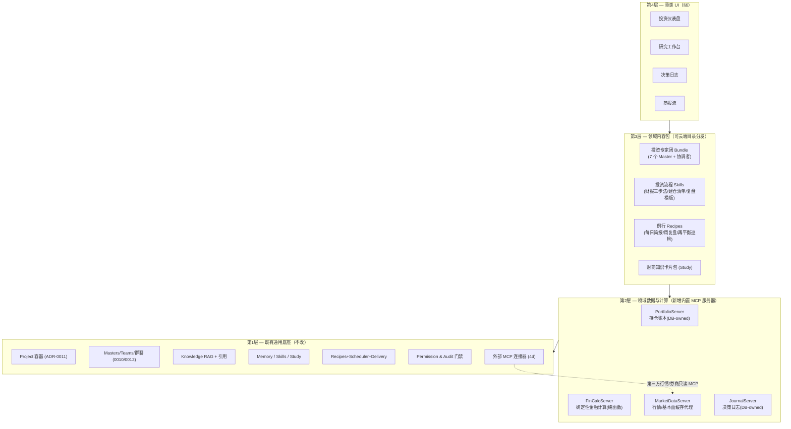

# 11 — 投资理财垂类 Agent 产品设计（Masters for Investing）

> 状态：**设计提案（design proposal）**。本文回答四个问题：投资理财垂类 Agent 与通用 Agent 的
> 核心能力/功能区别是什么；它解决用户的哪些问题；需要哪些模块与功能；产品 UI 如何设计。
> 设计原则：**不推翻任何既有 ADR（0001–0014）** —— 垂类化 = 在既有通用底座（Project 容器、
> Master 团队、Knowledge/RAG、Memory、Skills、Recipes+Scheduler+Delivery、Study、MCP 连接器、
> Permission & Audit）之上，叠加**领域数据层、确定性金融计算层、领域内容包与垂类 UI**。
> 中英术语对照：Master=专家、Master Team=专家团、Recipe=例行任务、Skill=技能、Grant=授权。

---

## 0. 一句话定位

**一个本地优先、隐私可控的「个人投资研究与理财陪伴」桌面 Agent**：
把用户分散的持仓、研报、财报、行情和新闻收拢进一个可审计的工作台，由一支各司其职的
AI 专家团（宏观、基本面、技术面、风控、税务、教练）做**有引用、有数据、有纪律**的分析，
按日/周/事件自动产出简报与复盘，并帮助用户建立长期的投资决策记录与知识体系。

**它是研究与决策辅助工具，不是投资顾问，也不执行交易**（见 §7 合规红线）。

---

## 1. 为什么投资理财需要垂类 Agent —— 与通用 Agent 的核心区别

通用 Agent（Cowork/Manus/通用版 Masters）的能力形状是「自由文本 + 文件操作 + 开放工具」。
投资理财场景对这四个维度提出了**结构性不同**的要求：

| 维度 | 通用 Agent | 投资理财垂类 Agent | 差异本质 |
|---|---|---|---|
| **数据层** | 用户手头的本地文件 | 行情/财报/宏观/新闻等**外部时序数据** + 持仓/交易等**个人结构化账本** | 数据不是「一堆文档」，而是有 schema、有时效、有来源可信度分级的领域数据 |
| **计算** | LLM 推理为主，计算是辅助 | 收益率、年化、回撤、夏普、集中度、再平衡偏离、定投成本等**必须由确定性代码计算**，LLM 只做解读 | **LLM 不许心算钱**。数字错一位 = 产品不可信；金融计算是工具，不是补全 |
| **时间性** | 任务多为一次性 | 行情有时效、财报有日历、定投有周期、再平衡有触发条件 | **调度器从「附属功能」升级为「核心引擎」**；每个数字都要带「数据截至」时间戳 |
| **记忆** | 通用偏好、任务上下文 | **风险画像**（承受力/期限/目标/禁忌）、持仓账本、**决策日志** | 记忆是分析的前置约束——不知道用户风险偏好的建议是危险的 |
| **角色分工** | 单一助手或临时分工 | 宏观/基本面/技术面/风控/税务视角**天然互斥又互补**，且**风控必须有一票否决式的独立性** | 专家团不是花活，是复刻真实投研流程的制衡结构 |
| **输出契约** | 自由文本 | 研报模板、评分卡、持仓表、图表、检查清单——**结构化、可对比、可归档** | 输出要能进入「日志→复盘→改进」的闭环，而非一次性对话 |
| **错误代价与合规** | 错了重来 | 错误可能造成真金白银损失；受投顾/荐股监管约束 | **免责声明、不荐股不代客、来源引用、全程审计**是产品底线而非附注 |
| **信任模型** | 结果可用即可 | 用户要能追问「这个数哪来的」「为什么这么判断」 | 引用（RAG citations）、审计面板、数据时效标签是**一等 UI 公民** |

一句话总结：**通用 Agent 卖的是「能做事」，投资垂类 Agent 卖的是「数字可靠、来源可查、
风险有人盯、纪律帮你守」**。这四条恰好逐一映射到 Masters 已有的四个底座：
确定性 MCP 工具（rmcp 内置服务器）、Knowledge/RAG 引用、Master 团队 + 权限审计、
Memory/Skills/Study/日志。

---

## 2. 解决用户的哪些问题（Persona 与痛点）

沿用 docs/00 的「一人深度服务」定位，投资场景下的三个典型画像：

### Persona I-A —「攒钱的上班族」（理财入门者）
> “工资到账就躺活期，买过几只基金亏了就不敢动。我想搞懂该怎么配置，但看不懂研报黑话。”

- **痛点**：不知道自己的风险承受力；金融知识碎片化；被销售话术/大V 情绪带节奏。
- **对应能力**：风险画像问卷 → `RISK_PROFILE.md`；**投资学习**（复用 Study：财商知识卡片 +
  间隔复习 + 学习计划）；教练型专家用白话解释持仓和概念；模拟组合先练手。

### Persona I-B —「有仓位的自主投资者」（核心画像）
> “股票基金分散在 3 个账户，没有全局视图。财报季看不过来，买卖全凭感觉，从不复盘。”

- **痛点**：①持仓分散无全局；②信息过载（财报/研报/新闻）；③风险敞口不自知（行业/个股
  集中度、隐性相关性）；④决策情绪化、无纪律、无复盘。
- **对应能力**：持仓账本聚合 + 仪表盘；财报/研报 RAG 摘要（带页码引用）；风控专家的
  集中度/回撤体检；**决策日志**（每笔操作先过论点清单，季度自动复盘打分）。

### Persona I-C —「重度研究型个人投资者」
> “我自己写研究笔记、读年报原文。我要的是研究效率工具，不是荐股，最好数据不出本地。”

- **痛点**：一份年报读一天；跨年报对比难；观点没有证据链；担心持仓隐私上云。
- **对应能力**：批量年报 ingest + 跨文档对比问答（引用到页）；专家团多视角互评
  （@基本面 @风控 交叉质询）；**本地优先 + 每专家模型边界**（ADR-0013：持仓相关分析可
  固定跑本地 Ollama 模型，数据不出设备）；导出研究备忘录。

### 归纳：产品要解决的六个问题

1. **看不全** —— 多账户持仓无全局视图 → 账本聚合 + 仪表盘。
2. **看不完** —— 财报/研报/新闻过载 → 定向 RAG 摘要 + 每日简报。
3. **看不懂** —— 专业门槛高 → 教练专家 + Study 学习闭环。
4. **算不准** —— 收益/风险指标靠感觉 → 确定性金融计算引擎。
5. **管不住** —— 情绪化交易、无纪律 → 决策清单（Skill）+ 决策日志 + 风控专家。
6. **忘得快** —— 从不复盘、经验不沉淀 → 定期复盘例行 + 决策归因 + 记忆/技能沉淀。

---

## 3. 总体架构：垂类 = 底座之上的四层叠加



**关键架构判断**（与既有 ADR 的关系）：

- **新增的都是 rmcp 内置 MCP 服务器**（ADR-0005 路径，同 Files/Knowledge/Memory/Study），
  受 FR-19 扩展开关控制，工具调用一律过 Permission & Audit（docs/06 不变式）。
- **账本与日志是 DB-owned 结构化数据**（同 Study 的 decks/cards 先例，ADR-0007 的例外面）：
  持仓、交易、决策记录有严格 schema，不适合手编 Markdown；而**风险画像是文件**
  （`RISK_PROFILE.md`，同 MEMORY.md——用户必须能直接读改自己的画像）。
- **金融计算是无状态纯函数**（同 `study::sm2` 先例）：输入持仓+价格序列，输出指标；
  可独立单测、无时钟依赖（时间由调用方注入）、LLM 只拿结果做解读。
- **外部行情源走 4d 连接器**（stdio MCP，env 隔离、凭证剥离），本体只内置一个
  **缓存代理层**（统一报价 schema + 「数据截至」戳 + 限频），不绑定任何单一数据商。
- **专家团/技能/卡片包是内容不是代码**：打成 4h Bundle + 云端目录（catalog）分发，
  迭代 persona 与流程**不需要发版**。

---

## 4. 模块设计

### 4.1 M1 · 持仓账本（Portfolio Ledger）—— 新内置 `PortfolioServer`

个人投资数据的**唯一真实来源**，本地 SQLite（新迁移，表均为 int/string，核心保持 lean）：

| 表 | 内容 |
|---|---|
| `accounts` | 账户（券商A/基金平台B/养老金），币种，类型 |
| `holdings` | 持仓快照：标的、数量、成本、账户 |
| `txns` | 交易流水：买/卖/分红/申赎/转入转出，费用 |
| `watchlist` | 自选关注列表 + 关注理由 |
| `price_cache` | 行情缓存（来源、时间戳，供离线与限频） |

- **录入方式**：①对话式（“我今天在 A 账户买了 200 股 XX，成本 …”→ 走 Write 门禁落库）；
  ②CSV/券商对账单导入（复用 PDF/DOCX 抽取器 seam 解析对账单，导入前展示 diff 预览，
  同「diff-in-approval」交互）；③手动表格编辑。**不做券商 OAuth 自动同步**（v1 非目标，
  第三方只读同步可由用户自担风险地接 4d 连接器）。
- **工具面**：`list_holdings`/`get_allocation`/`list_txns`（Read），
  `record_txn`/`import_statement`/`update_watchlist`（Write，须审批）。
- **隐私**：账本永不出库到云；发给模型的上下文可选**脱敏模式**（隐藏绝对金额，只给
  权重/比例——见 §7）。

### 4.2 M2 · 金融计算引擎（FinCalc）—— 新内置 `FinCalcServer`

确定性纯函数库 + 薄 MCP 壳（全部 Read 级）：

- **收益**：TWR/MWR（XIRR）、区间收益、年化、货币加权成本、定投成本线。
- **风险**：波动率、最大回撤、夏普/索提诺、Beta（对基准）、VaR（历史法）。
- **结构**：资产/行业/地域/币种配置，个股与行业**集中度**（HHI、前N占比）、
  与目标配置的**再平衡偏离度**及建议调仓量（含最小交易额约束）。
- **假设检验**：定投模拟、目标储蓄倒推（“年化 x%、每月投 y，n 年后多少”）、费用侵蚀。
- **纪律约束（prompt 合同）**：专家 persona 中写明——凡涉及数字**必须调用 FinCalc 工具**，
  引用工具返回值并附参数；禁止模型自行估算组合指标。UI 上每个指标卡可展开
  「计算依据」（工具调用参数+数据时间戳），复用 4g 工具可见性事件。

### 4.3 M3 · 市场数据层（MarketData）—— 缓存代理 + 外部连接器

- 内置 `MarketDataServer` 只定义**统一 schema**（报价/K线/基本面快照/财报日历/宏观指标）
  + 本地缓存 + 限频 + 「数据截至 T」戳；**具体数据源是可插拔的 4d stdio 连接器**
  （如社区 yfinance-mcp、AKShare-mcp、Tushare-mcp、自建），env 隔离、密钥走 OS keychain。
- 新闻/公告走同一路径（RSS/新闻 MCP 连接器），入库后可选转投 Knowledge 索引，
  使新闻摘要**可引用、可溯源**。
- **降级策略**：无任何行情源时产品仍可用（账本+研报 RAG+学习+日志都不依赖行情），
  相关卡片显示「未配置数据源」而非报错——与「daemon 拒绝无 provider 启动」不同，
  行情是增强而非前置。

### 4.4 M4 · 研究知识库 —— 复用 Knowledge/RAG（零新代码）

- 直接复用 2a/2c：年报/研报/招募说明书 PDF ingest → 分块 → 向量+FTS 混合检索 →
  **带页码引用**回答。这是通用底座在垂类里的最大红利。
- 垂类增强（后续迭代）：按标的/报告期打元数据标签，支持「对比 XX 2023 vs 2024 年报的
  毛利率论述」这类**跨文档定向检索**；财报表格抽取质量优化。

### 4.5 M5 · 投资者画像 —— 复用 Memory（文件为真）

- `RISK_PROFILE.md`（新的项目级记忆文件，同 MEMORY.md/USER.md 地位）：风险承受等级、
  投资期限、目标（教育金/养老/购房）、流动性需求、**禁忌清单**（不碰杠杆/不碰某行业）、
  经验水平。由**引导式问卷**（教练专家主持的一次对话）生成，用户可随时手改。
- 通过既有 PromptContext 自动注入每次会话——**所有专家的每个建议都以画像为前置约束**
  （“该建议超出你的风险画像”是风控专家的固定话术之一）。

### 4.6 M6 · 投资专家团 —— 复用 Masters/Teams/群聊（内容包）

一个 4h Bundle：`investment-committee.bundle.json`（云端目录分发，一键导入）：

| 专家（slug） | 职责 | `allowed_tools`（最小权限） | 建议模型档位 |
|---|---|---|---|
| **首席顾问 @chief**（协调者） | 汇总各方观点、给结构化结论、主持流程 | Portfolio/FinCalc/Knowledge（读） | 旗舰（Opus 级） |
| **宏观分析师 @macro** | 利率/通胀/周期/政策对配置的含义 | MarketData、Knowledge | 中档 |
| **基本面分析师 @fundamental** | 财报解读、估值、商业模式，逐条引用 | Knowledge、MarketData | 旗舰 |
| **技术面分析师 @technical** | 趋势/量价/关键位（仅描述状态，不给买卖点） | MarketData、FinCalc | 中档 |
| **风控官 @risk** | 集中度/回撤/相关性体检、画像合规检查、唱反调 | Portfolio、FinCalc | 旗舰 |
| **税费顾问 @tax** | 费率、税务口径提示（一般性知识 + 免责） | Portfolio、Knowledge | 中档 |
| **投资教练 @coach** | 白话解释、行为金融纠偏、学习计划、主持复盘 | Study、Memory、Journal | 中档/本地 |

- **机制全部现成**：@提及路由（含 CJK）、无提及→首席顾问、多轮互评（4f，
  例如 @fundamental 结论自动 @risk 质询一轮）、按专家归属的流式输出与工具可见性
  （4e/4g）、每专家独立模型（ADR-0013——**涉及持仓明细的 @risk 可固定本地模型**）。
- **输出契约**（`output_contract`）：首席顾问产出固定结构的「投资备忘录」；风控官产出
  「风险体检卡」（评分+红黄绿）；基本面产出「财报速读表」。结构化输出使 UI 可渲染成
  卡片而非纯文本，也使季度复盘可对比。

### 4.7 M7 · 投资流程 Skills —— 复用 Skills（内容包）

预置 + 允许 Agent 自我沉淀（ADR-0006）：`财报三步分析法`、`建仓前检查清单`
（论点/反论点/失效条件/仓位上限）、`再平衡执行流程`、`每周复盘模板`、`新基金尽调清单`。
用户跑顺的流程，Agent 会提议存为新 Skill——垂类里**纪律本身就是最有价值的技能**。

### 4.8 M8 · 例行任务 —— 复用 Recipes + Scheduler + Delivery（内容包）

| Recipe | 触发 | 产出与投递 |
|---|---|---|
| 每日盘后简报 | cron 工作日收盘后 | 持仓涨跌归因 + 自选异动 + 相关新闻摘要 → OS 通知/邮件 |
| 每周持仓复盘 | 周日晚 | 周度收益/回撤 + 配置漂移 + 下周财报日历 |
| 再平衡巡检 | 每日 | 偏离超阈值才产出提醒（静默通过不打扰） |
| 财报日历哨兵 | 每日 | 持仓/自选 N 日内出财报 → 提前提示 + 会后自动速读 |
| 月度理财体检 | 每月1日 | 储蓄率、目标进度、费用侵蚀、风控体检卡 |
| 季度决策复盘 | 每季 | 决策日志归因：命中/失误/教训 → 更新 MEMORY.md |

全部走既有 headless 运行路径（grant 内 + 审计），邮件默认关闭（ADR-0009 不变）。

### 4.9 M9 · 决策日志（Decision Journal）—— 新内置 `JournalServer`（垂类差异化的灵魂）

- `decisions` 表：时间、标的、动作（买/卖/持有/放弃）、**论点**、**反论点**、
  **失效条件**、情绪自评、关联会话 id（可回跳当时的完整讨论与审计轨迹）。
- 写入时机：①用户在对话中做出决定，教练专家提议“记入日志？”（Write 审批）；
  ②`record_txn` 落库时提示补写决策依据。
- **复盘闭环**：季度复盘 Recipe 把日志 + 后续实际走势（FinCalc 计算）做归因——
  “你止损纪律执行率 40%”“追高买入的三笔平均回撤 -18%”——结论沉淀进 Memory，
  下次同类决策时自动出现在上下文里。**这是通用 Agent 完全没有的复利飞轮。**

### 4.10 M10 · 投资学习 —— 复用 Study（零新代码 + 内容包）

财商知识卡片包（云目录分发）+ 从用户自己的研报/亏损案例生成个性化卡片 + SM-2 复习 +
针对“看懂财报”这类目标的自适应学习计划（3b）。学习模块与 I-A 画像强绑定，
也是产品从「工具」走向「陪伴」的关键。

### 4.11 模块 × 底座映射总表

| 模块 | 新代码量 | 复用 |
|---|---|---|
| M1 账本 / M2 计算 / M9 日志 | 新内置 MCP 服务器 + 迁移（同 Study 模式） | 门禁/审计/扩展开关/事件日志 |
| M3 行情 | 薄缓存代理 | 4d 连接器 + keychain |
| M4 研报 / M10 学习 | **零** | Knowledge、Study |
| M5 画像 | 一个新记忆文件 + 问卷流程 | Memory/PromptContext |
| M6 专家团 / M7 技能 / M8 例行 | **零代码，纯内容** | 4a–4h + 3c/3d/3e + 云目录 |
| 垂类 UI（§6） | 新前端视图 | docs/10 设计系统 |

---

## 5. 功能需求清单（FR-INV-*，独立于主 PRD 编号）

| ID | 需求 | 优先级 |
|---|---|---|
| FR-INV-1 | 多账户持仓账本：对话/CSV/手工三种录入，导入前 diff 预览审批 | P0 |
| FR-INV-2 | 投资仪表盘：总资产、配置结构、收益曲线、风险指标卡（每个数字带时间戳+计算依据） | P0 |
| FR-INV-3 | 确定性金融计算工具集（收益/风险/结构/假设检验），LLM 禁止心算组合数字 | P0 |
| FR-INV-4 | 风险画像问卷 → `RISK_PROFILE.md`，自动注入所有会话，用户可编辑 | P0 |
| FR-INV-5 | 投资专家团 Bundle（7 角色）+ @提及群聊研究、多轮互评、风控独立视角 | P0 |
| FR-INV-6 | 研报/年报 RAG 问答与摘要，答案带页码引用 | P0（复用） |
| FR-INV-7 | 行情/基本面数据经统一缓存代理接入，可插拔数据源连接器，未配置时优雅降级 | P1 |
| FR-INV-8 | 例行简报族（日/周/月/季 + 财报哨兵 + 再平衡巡检）+ 通知/邮件投递 | P1 |
| FR-INV-9 | 决策日志：论点/反论点/失效条件结构化记录，季度自动归因复盘并沉淀记忆 | P1 |
| FR-INV-10 | 投资学习：财商卡片包 + 个性化生成 + SM-2 + 学习计划 | P1（复用） |
| FR-INV-11 | 建仓/卖出检查清单 Skills，决策前强制走查（可跳过但记录） | P1 |
| FR-INV-12 | 脱敏模式：发往云端模型的上下文隐藏绝对金额（只保留比例/权重） | P1 |
| FR-INV-13 | 全局免责声明 + 每份分析尾注 + 敏感请求（荐股/保证收益）的标准边界话术 | P0 |
| FR-INV-14 | 涨跌配色跟随地区习惯（红涨绿跌/绿涨红跌）可切换 | P2 |
| FR-INV-15 | 研究备忘录导出（Markdown/PDF），含引用与数据快照 | P2 |
| FR-INV-16 | 模拟组合（paper portfolio）：与真实账本并列，供练手与策略对照 | P2 |
| FR-INV-17 | 目标规划：教育金/养老/购房目标倒推与进度追踪 | P2 |

**非功能（垂类新增）**：
NFR-INV-1 组合指标数值零 LLM 生成（全部来自 FinCalc）；NFR-INV-2 每个外部数据点必须携带
来源与时间戳；NFR-INV-3 持仓/交易数据默认不出设备（脱敏模式为云端模型的默认建议）；
NFR-INV-4 所有涉及账本/日志写入的操作可审批、可审计、可回滚（复用 revision/audit）。

---

## 6. 产品 UI 设计

### 6.1 设计原则（承接 docs/10，垂类扩展）

1. **信任前置**：数据时效戳、来源角标、「计算依据」展开、审计面板——比美观优先。
2. **数字的排版尊严**：金额/百分比一律等宽数字（tabular-nums），右对齐，统一精度。
3. **语义涨跌色**：新增 token `--color-gain` / `--color-loss`（不复用 danger/success——
  跌不是「错误」），支持红绿习惯切换（FR-INV-14），色弱模式追加 ▲▼ 符号冗余编码。
4. **克制的图表**：sparkline/环形图/条形图用现有依赖极简实现（SVG 手绘或极轻库），
  不引入重型图表框架——与「dependency-light」原则一致。
5. **免责声明是设计元素**：首启弹层确认 + 分析产出尾注固定样式，不做成可忽略的灰字。

### 6.2 信息架构（侧边栏）

```
┌──────────────┐
│ 💬 对话       │  ← 现有 Chat（含审计右栏）
│ 📊 仪表盘     │  ← 新增：投资总览（默认落地页）
│ 💼 持仓       │  ← 新增：账本明细/导入/自选
│ 🔬 研究       │  ← 专家团群聊 + 证据面板（GroupChat 垂类化）
│ 📰 简报       │  ← 例行产出流（Routines 的阅读视图）
│ 📓 日志       │  ← 决策日志时间线
│ 🎓 学习       │  ← Study 垂类皮肤
│ 📁 项目 / ⚙ 设置│  ← 现有
└──────────────┘
```

### 6.3 核心屏幕

**① 仪表盘（Dashboard）** —— 落地页，回答“我现在怎么样”：

```
┌─ 总资产 ¥1,234,567  今日 +0.8% ▲ ─ 数据截至 15:32 ─ [🙈脱敏] ┐
│  [收益曲线 sparkline · 1M/3M/1Y/全部]                        │
├──────────────┬──────────────┬─────────────────────────────┤
│ 资产配置环形图 │ 风险体检卡    │ 待办/提醒                    │
│ 股60 债25 现15│ 集中度 ⚠ 黄   │ · XX 财报 3 天后              │
│ vs 目标偏离 4%│ 回撤 ✓ 绿    │ · 再平衡偏离超 5% → 去研究    │
│              │ 画像匹配 ✓ 绿 │ · 周复盘已生成 → 查看        │
├──────────────┴──────────────┴─────────────────────────────┤
│ 持仓 Top 5（名称/权重/成本/现价/盈亏%…等宽右对齐）           │
└─ ⓘ 本页为分析工具输出，不构成投资建议 ────────────────────┘
```

每个指标卡可点开「计算依据」抽屉：FinCalc 调用参数、数据来源与时间戳（复用 4g 工具事件）。
任意卡片一键「去研究」→ 带上下文跳转研究工作台并预填 brief。

**② 研究工作台（Research）** —— 垂类化的 GroupChat，三栏：

- 左：专家名册（头像/職责/模型徽章——本地模型专家标 🏠「数据不出设备」）。
- 中：群聊流（按 4e/4f 现有机制：@提及、轮次分隔线、逐专家流式气泡、
  工具调用暗色行）。风控官的异议气泡带左侧警示色条——**制衡可见**。
- 右：**证据面板**（垂类关键新组件）：本轮所有 RAG 引用（文档+页码，点击预览原文段落）、
  FinCalc 结果表、行情快照——把「结论」与「依据」并排呈现。
- 底部快捷 brief 模板：「体检我的组合」「速读 XX 财报」「这只基金值得买吗→自动转边界话术+研究框架」。

**③ 持仓（Portfolio）**：账户分组表格 + 行业/地域分布条形图 + 交易流水；
CSV 导入向导（解析预览 → diff 审批 → 落库，复用 diff-in-approval 模式）；自选列表带「关注理由」。

**④ 简报流（Briefings）**：例行产出按时间倒序卡片流（未读态、按 Recipe 筛选）；
每张简报卡可展开全文、跳到当时数据快照、或「就此提问」转入研究工作台。

**⑤ 决策日志（Journal）**：时间线视图，每条 = 标的+动作+论点/反论点/失效条件+情绪标签；
已验证的决策显示事后收益徽章（绿/红）；季度复盘报告置顶；可回跳原始会话与审计轨迹。

**⑥ 学习（Learn）**：Study 的垂类皮肤——今日到期卡片、学习计划进度、
「从我的持仓生成卡片」「从这份研报生成卡片」入口。

### 6.4 关键交互细节

- **审批话术垂类化**：写账本的审批卡显示为「记录一笔交易：买入 XX 200 股 @¥xx」+
  结构化字段预览，而非原始 JSON。
- **边界话术交互**：用户问“该不该全仓买 XX”→ 不是冷拒绝，而是首席顾问回应固定框架：
  “我不能给出买卖指令，但可以：①对照你的风险画像评估 ②让 @risk 出体检
  ③给你一份该标的的研究框架”——把合规变成产品体验。
- **脱敏开关**（🙈）：全局顶栏一键隐藏绝对金额（UI + 发往云端模型的上下文同时生效）。
- **空状态即引导**：无账本→“导入第一份对账单/告诉我你的持仓”；无数据源→连接器向导；
  无画像→“先花 5 分钟让教练了解你”。

---

## 7. 安全、隐私与合规红线

1. **不是投顾**：不给具体买卖指令/点位/仓位命令，不承诺收益，不代客决策。专家 persona
   与输出契约中固化边界话术；全局免责声明（首启确认 + 产出尾注）。
2. **不执行交易**：不接券商交易 API（读输出都不接入下单通道）——账本是记录，不是通道。
   这是 ADR-0009「outbound-only」在垂类的对应红线。
3. **隐私分层**（ADR-0013 红利）：持仓明细类分析可路由本地模型专家；云端模型默认建议
   脱敏模式；embeddings/索引/账本全部本地（NFR-1/6 不变）。
4. **全程审计**：账本写入、日志写入、每次投递均过 Permission & Audit + 事件日志；
   连接器 env 隔离与密钥 keychain 照旧（4d/ADR-0008）。
5. **数据源合规**：连接器由用户自行配置并遵守数据商条款；产品不内置爬虫、不转售行情。

---

## 8. 实施路线（增量，先内容后代码）

| 阶段 | 内容 | 代码量 |
|---|---|---|
| **V0 · 内容包验证**（周级） | 用现有能力交付：投资专家团 Bundle + 流程 Skills + 简报 Recipes + 财商卡片包，经云目录分发；研报 RAG、Study、Memory 画像文件即刻可用 | ≈0（纯内容 + 目录条目） |
| **V1 · 账本与计算**（核心投入） | `PortfolioServer` + `FinCalcServer`（迁移 + rmcp + 纯函数库）；持仓页 + 仪表盘 v1；`RISK_PROFILE.md` 问卷流 | 中 |
| **V2 · 数据与例行** | `MarketDataServer` 缓存代理 + 行情连接器接入向导；简报族 Recipes 接上真实数据；简报流视图 | 中 |
| **V3 · 纪律闭环** | `JournalServer` + 日志时间线 + 季度归因复盘；脱敏模式；研究工作台证据面板 | 中 |
| **V4 · 打磨** | 模拟组合、目标规划、备忘录导出、跨年报对比检索、涨跌配色偏好 | 小-中 |

V0 的意义：**在写任何 Rust 之前，用真实用户验证「专家团 + 研报 RAG + 例行简报」这个
垂类叙事是否成立**——Masters 的通用底座使垂类假设可以以内容包的成本先行试错。

---

## 9. 与既有文档/ADR 的关系

- 不修改任何既有 ADR；若 M1/M2/M9 进入实施，需新增 ADR（建议：`0015-vertical-domain-packs`
  ——垂类=内容包+领域 MCP 服务器的通用模式；`0016-portfolio-ledger-storage`——账本 DB-owned
  与脱敏边界）。
- docs/01 PRD 增补 FR-INV-* 段；docs/10 增补涨跌色 token 与数字排版规范。
- 本文的模式可复制到下一个垂类（如法律/健康）：**「底座不动，四层叠加」是 Masters
  作为垂类 Agent 工厂的产品化路径。**
